# Deep Research Blog Writer

Give it a topic. It searches the web, cleans and ranks the URLs, fetches what it can, builds a source corpus, writes a research summary, drafts the article, and checks every citation before calling the run complete.

If the citations do not line up, the run fails **without throwing the work away**. The last draft stays in the workspace with a machine-readable reason for the failure.

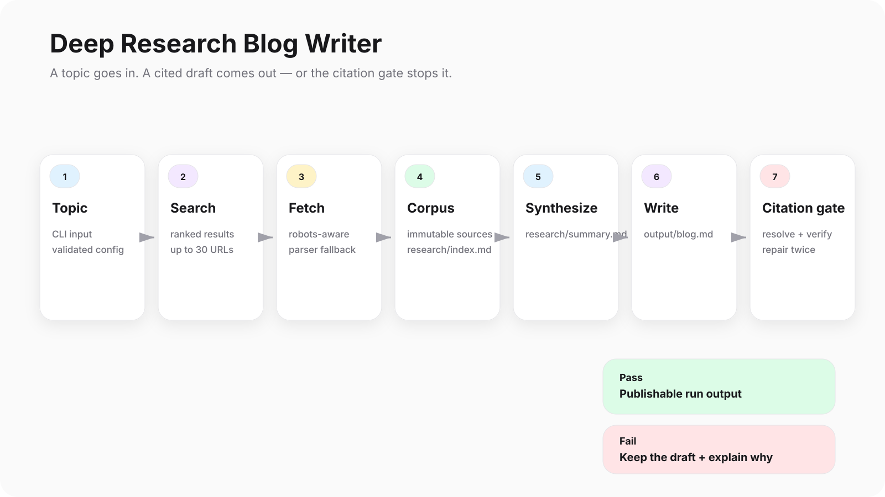

> Built in Python with DeepAgents on LangGraph. EPIC-1 through EPIC-11 are delivered. The project includes typed contracts and tools, search and fetch workflows, corpus construction, research synthesis, authoring, citation validation, retry/resume building blocks, observability, offline evaluation, and per-agent skill/contract documentation.

**Documentation site:** https://josoroma.github.io/deep-research-blog-writer

---

## The 60-second version

A live run is intentionally boring:

1. **Search** for ranked source URLs.
2. **Collect** those URLs into a research corpus.
3. **Author** from that corpus and run the citation gate.

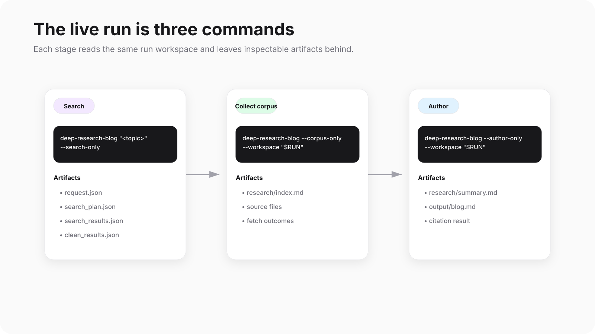

```sh
SEARCH_TIMEOUT_SECONDS=60 uv run deep-research-blog \
  "Python LangChain Deep Agents Startup Ideas" \
  --search-only \
  --pages 3 \
  --per-page 10 \
  --max-urls 30
```

The command prints a workspace path. Reuse it for the next two stages:

```sh
RUN=runs/python-langchain-deep-agents-startup-ideas-20261001T195605Z

uv run deep-research-blog --corpus-only --workspace "$RUN"
uv run deep-research-blog --author-only --workspace "$RUN"
```

Each stage leaves artifacts in the same run directory, so you can inspect what happened instead of treating the agent as a black box.

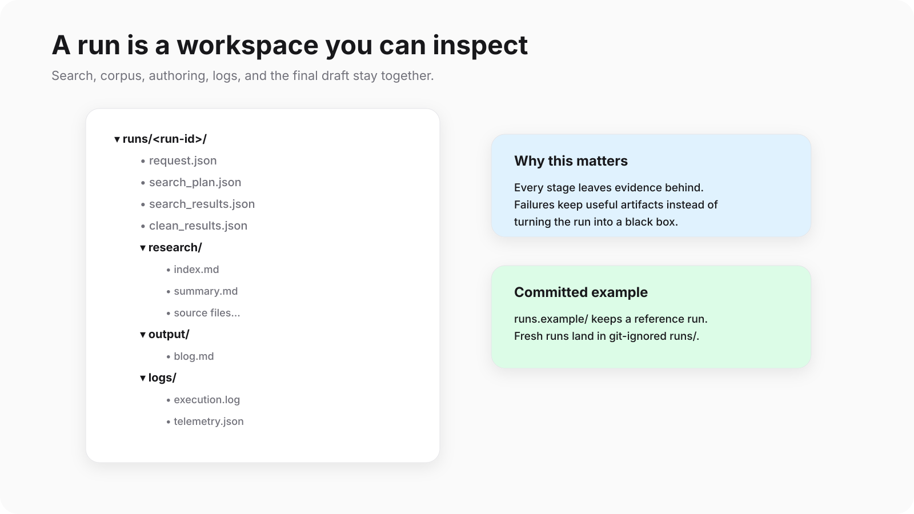

---

## Install

Prerequisites:

- Git
- [uv](https://docs.astral.sh/uv/getting-started/installation/)
- Make

`uv` selects Python 3.12 through `.python-version` and can install it when needed.

```sh
make setup
make check
make demo-epic-4
make demo-epic-5
```

`make setup` installs from `uv.lock` and installs the Git hook.

`make check` verifies:

- the lock file
- Ruff
- formatting
- strict typing
- offline tests
- an 80% coverage floor

No server is required for the core pipeline.

---

## Credentials

Create `.env` only when it does not already exist:

```sh
cp -n .env.example .env
```

Then add the provider keys you actually use:

```dotenv
SEARCH_PROVIDER=serpapi
SERPAPI_API_KEY=<your SerpApi key>
OPENROUTER_API_KEY=<your OpenRouter key>
```

`.env` and `runs/` are Git-ignored.

SerpApi and Serper are separate providers. If you use Serper:

```dotenv
SEARCH_PROVIDER=serper
SERPER_API_KEY=<your Serper key>
```

There is no fallback between the two credentials.

All five model IDs are independently configurable:

```dotenv
MODELS__ORCHESTRATOR=openrouter:deepseek/deepseek-v4.1-flash
MODELS__SEARCH_AGENT=openrouter:deepseek/deepseek-v4.1-flash
MODELS__RESEARCH_AGENT=openrouter:deepseek/deepseek-v4.1-flash
MODELS__ANALYST_AGENT=openrouter:deepseek/deepseek-v4.1-flash
MODELS__WRITER_AGENT=openrouter:deepseek/deepseek-v4.1-flash
```

Environment variables override `.env`.

---

## How the agents fit together

The orchestrator delegates work to the search, research, analyst, and writer agents. Provider clients and credentials stay outside agent/checkpoint state.

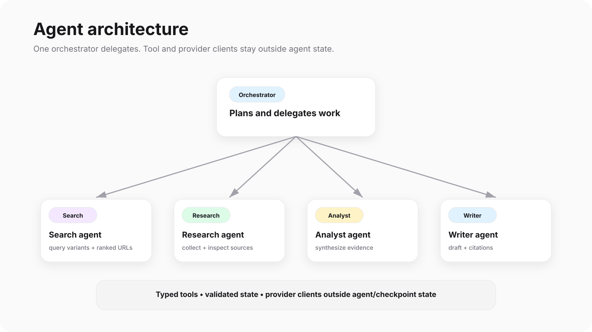

The repository keeps responsibilities separated:

| Directory | Responsibility |
| --- | --- |
| `agents/` | Orchestration; models from `LLMService`, prompts from the catalog |
| `tools/` | Typed execution and validated state updates |
| `workflows/` | CLI, assembly, and run lifecycle |
| `prompts/` | Packaged agent prompts |
| `schemas/` | Pydantic contracts |
| `services/` | Provider integration, per-run search session, workspace services |
| `evaluations/` | Architecture checks and runnable demonstrations |
| `tests/` | Offline regression and opt-in live tests |
| `docs/` | ADRs, agent docs, recorded delivery evidence, explainer pages |
| `docs/architecture/` | A `skill.md` and `contract.md` for every agent |
| `docs/SPECS-LOGS/` | Per-epic plans and runbooks |

Agents never import HTTP clients or construct provider clients. Search tools validate both input and output.

---

## Search

For a live provider smoke test:

```sh
make smoke-epic-4
```

For a full search-only run:

```sh
SEARCH_TIMEOUT_SECONDS=60 uv run --locked deep-research-blog \
  "2026 agentic AI frameworks" \
  --search-only
```

The production orchestrator derives 2–3 query variants, searches topic pages 1–3 plus each variant's first page, normalizes the URLs, filters denied hosts and duplicates, caps the result set, and writes:

- `request.json`
- `search_plan.json`
- `search_results.json`
- `clean_results.json`

Inspect the workspace:

```sh
uv run --locked python scripts/inspect-search-artifacts.py runs/<run_id>
```

For a reproducible provider-only run, pass two or three repeated `--query-variant` arguments with `--search-only`. That avoids a model call.

You can override the configured budgets with:

```text
--pages
--per-page
--max-urls
```

SerpApi Google search requires `--per-page 10`.

### Example search output

```json
{
  "run_id": "python-langchain-deep-agents-startup-ideas-20261001T195605Z",
  "workspace": "runs/python-langchain-deep-agents-startup-ideas-20261001T195605Z",
  "status": "completed",
  "provider": "serpapi",
  "search_plan_path": "runs/python-langchain-deep-agents-startup-ideas-20261001T195605Z/search_plan.json",
  "raw_results_path": "runs/python-langchain-deep-agents-startup-ideas-20261001T195605Z/search_results.json",
  "clean_results_path": "runs/python-langchain-deep-agents-startup-ideas-20261001T195605Z/clean_results.json",
  "counts": {
    "raw": 52,
    "denied": 9,
    "duplicates": 2,
    "capped": 11,
    "kept": 30
  },
  "error": null
}
```

---

## Fetch and extraction

Set a public crawler contact in `.env`:

```dotenv
CRAWLER_CONTACT=<public URL or email>
```

Then fetch and extract the clean URLs from a completed search workspace:

```sh
uv run --locked deep-research-blog --fetch-only --workspace runs/<search_run_id>
uv run --locked python scripts/inspect-fetch-artifacts.py runs/<search_run_id>
make smoke-epic-5
```

Fetch-only needs no LLM key and no search key.

It writes:

- `fetch_outcomes.json`
- `extraction_results.json`
- `fetch_state.json`

Individual failures are recorded while the run continues.

The fetcher:

- identifies the crawler on every request
- respects robots rules
- robots-checks redirect destinations
- shares a 15-second network/body budget across redirects
- retries transient failures up to three times
- keeps at most five active fetches
- waits at least one second between starts on the same hostname
- skips non-HTML and blocked pages before extraction

Parser fallback order:

```text
trafilatura → readability-lxml → beautifulsoup4
```

The default minimum is 200 visible body words.

Override the parser with:

```dotenv
EXTRACTOR_STRATEGY=trafilatura
```

Valid values:

```text
trafilatura | readability | beautifulsoup | fallback
```

---

## Corpus collection

The committed example processed all 30 URLs. It wrote and indexed 21 sources while continuing past individual failures:

```json
{
  "run_id": "python-langchain-deep-agents-startup-ideas-20261001T195605Z",
  "workspace": "runs/python-langchain-deep-agents-startup-ideas-20261001T195605Z",
  "status": "completed",
  "urls_processed": 30,
  "sources_written": 21,
  "sources_indexed": 21,
  "outcomes": {
    "extracted": 21,
    "unreachable": 6,
    "robots_disallowed": 1,
    "too_thin": 2
  },
  "index_path": "research/index.md",
  "error": null
}
```

Fresh runs live in Git-ignored `runs/`. The committed `runs.example/` directory keeps a reference output.

---

## Authoring and the citation gate

Authoring writes:

```text
research/summary.md
output/blog.md
```

Then it verifies the citations.

The committed example produced a 3,193-word draft with 17 citations. Every citation resolved to a source file, but two reference entries had a title or URL mismatch. Two repair passes did not fix them, so the run failed and kept the last draft:

```json
{
  "run_id": "python-langchain-deep-agents-startup-ideas-20261001T195605Z",
  "workspace": "runs/python-langchain-deep-agents-startup-ideas-20261001T195605Z",
  "status": "failed",
  "summary_path": "research/summary.md",
  "blog_path": "output/blog.md",
  "word_count": 3193,
  "citations_checked": 17,
  "repair_passes": 2,
  "dangling_source_ids": [],
  "mismatched_source_ids": ["S-14", "S-24"],
  "reason": "dangling_citations",
  "error": null
}
```

That failure is useful: the pipeline does not silently turn a citation mismatch into a "successful" article.

---

## Evaluation and release gate

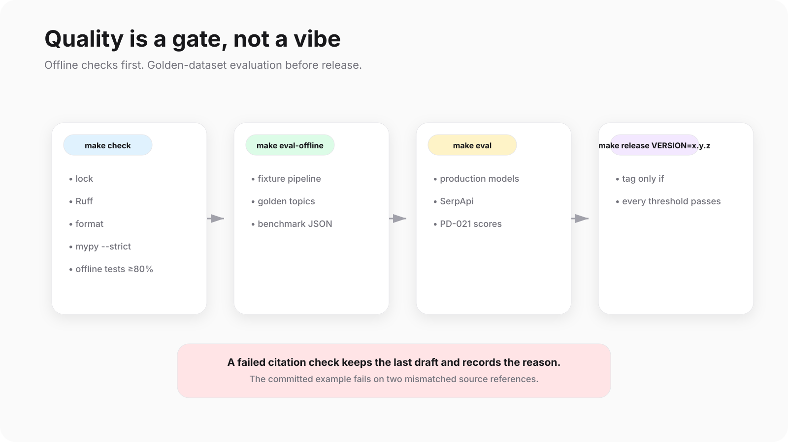

The unit suite is offline. It removes provider credentials and blocks sockets, so it needs no keys and no network.

Run the offline demos and evaluation:

```sh
make demo-epic-10
make eval-offline
```

`make eval-offline` runs the fixture pipeline for every golden topic and writes:

```text
evaluations/benchmarks/<date>-<commit>.json
```

For a live evaluation and release:

```sh
make eval
make release VERSION=1.0.0
```

The release gate checks every golden topic against the PD-021 thresholds before creating a tag.

Topics are scored for:

- citation validity
- length
- coverage
- groundedness
- hallucination rate
- every PRD.md §13 Definition of Done item

The judge defaults to DeepSeek V4.1 Flash on OpenRouter.

---

## Development checks

```sh
make check
make hooks
make boundary
make format
make build
sh scripts/verify-epic-5-package.sh
sh scripts/verify-epic-5-checkout.sh
uv run --locked pytest -m live tests/test_search_workflow.py --no-cov
```

The package verifier runs the installed wheel outside the checkout.

The checkout verifier clones committed files into a temporary directory, installs locked dependencies, runs the offline gates and demos, builds, and verifies the wheel without `.env`.

Live tests are opt-in and excluded from offline gates.

---

## Observability

Each run writes local observability data to:

```text
runs/<run-id>/logs/execution.log
runs/<run-id>/logs/telemetry.json
```

Registered tools, native model calls, retries, source outcomes, and citation checks populate the counters.

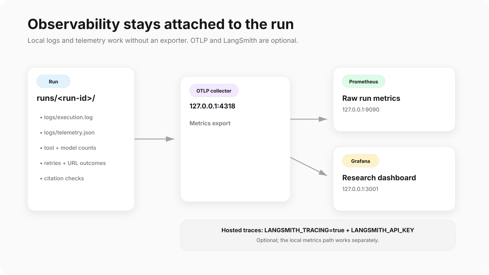

Start the local stack:

```sh
make setup
make demo-epic-9
make observability-up
make smoke-epic-9
```

Open:

- Grafana: http://127.0.0.1:3001/d/research-runs
- Prometheus: http://127.0.0.1:9090

To export normal CLI metrics to the local stack:

```dotenv
OTEL_EXPORTER_OTLP_ENDPOINT=http://127.0.0.1:4318
```

For hosted LangSmith traces:

```dotenv
LANGSMITH_TRACING=true
LANGSMITH_API_KEY=<your key>
LANGSMITH_PROJECT=<optional project>
```

Then:

```sh
make smoke-langsmith
```

Stop the local stack:

```sh
make observability-down
```

Named volumes are retained.

### Existing observability screenshots

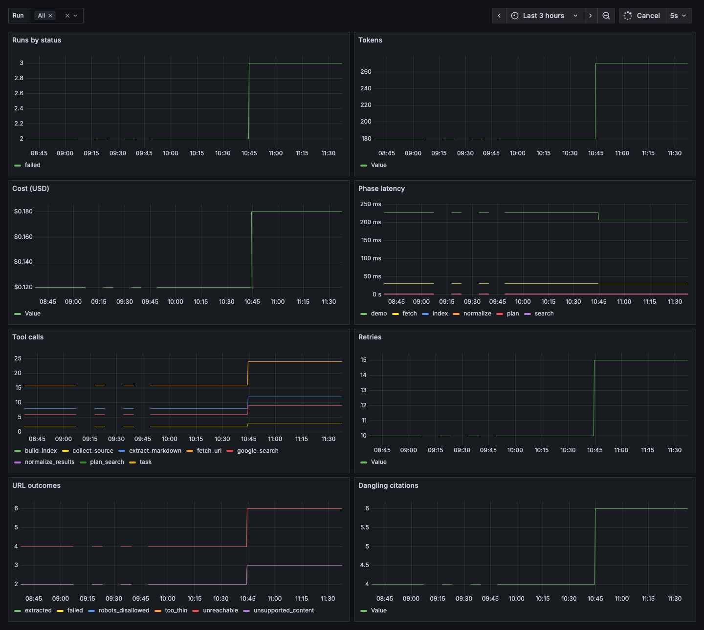

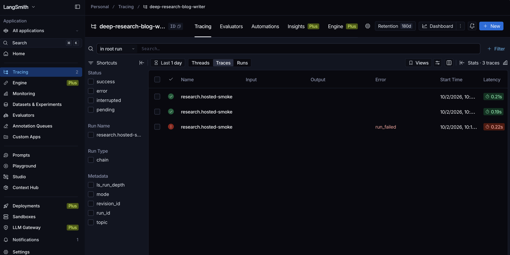

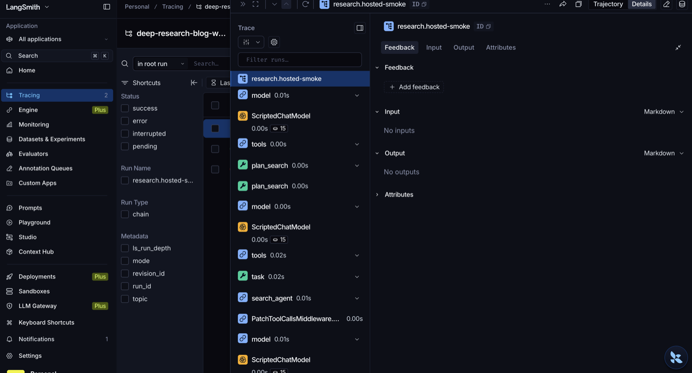

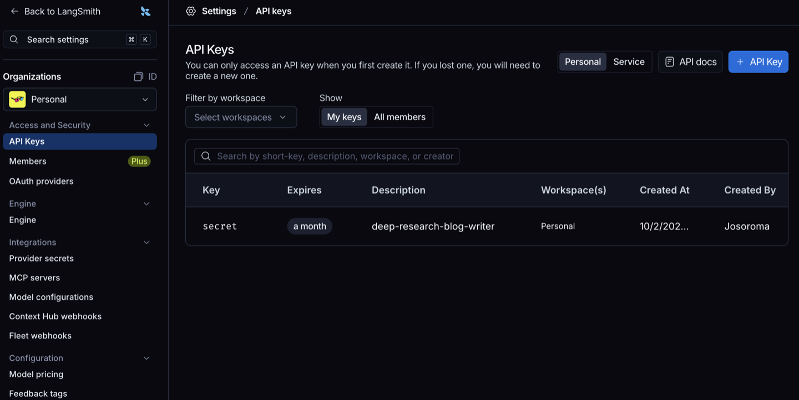

---

## One epic per session

The delivery rule is simple: finish one epic before touching the next one.

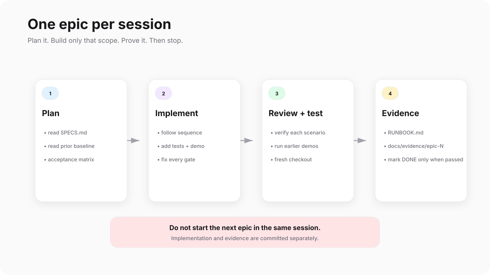

### 1. Plan

```text
Plan EPIC-N: <epic title from SPECS.md> in docs/SPECS-LOGS/EPIC-N.md.

Read the EPIC-N section of SPECS.md first: the objective, every user story and its acceptance scenarios, the tasks, and the product decisions the stories cite. Read the previous epic's plan and the code it left behind, and write the plan against that baseline rather than against the specification alone.

EPIC-N.md must contain: the objective, the current baseline, a numbered implementation sequence, an acceptance matrix mapping each scenario to evidence, a completion checklist, and an explicit scope boundary naming what belongs to later epics. Status is Planned. Do not implement anything, and do not mark any story done.
```

### 2. Implement

```text
docs/SPECS-LOGS/EPIC-N.md exists. Implement EPIC-N from it, in the order its sequence gives, and stop at its scope boundary.

Follow the repository conventions: Pydantic v2 strict contracts, tools registered through the tool registry with stubs left in place for anything this epic does not replace, and the offline suite kept network-blocked. Add tests for every row of the acceptance matrix, plus an offline demo at evaluations/epicN_demo.py and a Makefile demo-epic-N target that needs no API key.

When the tests pass, run the gates and record only the commands that actually passed: uv run --locked ruff check, ruff format --check, mypy --strict, pytest -m 'not live', make demo-epic-N, make hooks, make build, and the installed-wheel check. Fix failures rather than skipping a gate.
```

### 3. Review and test

```text
Review and test the EPIC-N implementation against its own plan. Do not add features.

Check each acceptance scenario against the code and the tests, and report any scenario that has no evidence. Run the full offline gate, the new demo, and the demos of every earlier epic. Then verify the built wheel outside the checkout and do a fresh-checkout run of setup, gates, hooks, and demos.

Write docs/SPECS-LOGS/EPIC-N-RUNBOOK.md with the commands that passed, the PM demo steps, and an evidence table. Save coverage, the command list, and a source manifest pinned to the implementation commit under docs/evidence/epic-N/. Mark a story or task DONE in SPECS.md only when its scenario passed. Commit the implementation and the evidence separately, with hooks active, and exclude .env and runs/.
```

---

## Service URLs

Local URLs only work while `make observability-up` is running. Every local port is bound to `127.0.0.1`.

| Service | URL | Used for |
| --- | --- | --- |
| Grafana dashboard | http://127.0.0.1:3001/d/research-runs | Run metrics panels |
| Prometheus | http://127.0.0.1:9090 | Raw run metrics |
| OTLP collector | `http://127.0.0.1:4318/v1/metrics` | CLI metrics export |
| LangSmith | https://smith.langchain.com | Hosted traces |
| LangSmith API | https://api.smith.langchain.com | `LANGSMITH_ENDPOINT` default |
| OpenRouter | https://openrouter.ai | Agent model access |
| SerpApi | https://serpapi.com | Search provider |
| Serper | https://serper.dev | Search provider |
| LangGraph | https://docs.langchain.com/oss/python/langgraph/overview | Runtime under DeepAgents |
| DeepAgents | https://docs.langchain.com/oss/python/deepagents/overview | Orchestrator and sub-agent harness |
| Documentation | https://josoroma.github.io/deep-research-blog-writer | Project explainer |

---

## More detail

For the full implementation record, architecture decisions, and per-epic evidence:

- `SPECS.md` — product decisions and epic status
- `docs/SPECS-LOGS/` — plans and runbooks
- `docs/adr/` — architecture decisions
- `docs/architecture/` — per-agent `skill.md` and `contract.md`
- `docs/evidence/` — recorded delivery evidence
- `docs/pages/running-a-run.html` — visual walkthrough of a live run

The README should get you running. The docs explain why the system is built this way.
