# Deep Research Blog Writer — Iterable Product Specification

CODEBASE Context: EPIC-1 foundation implemented on 2026-09-30; EPIC-2 contracts and agent building blocks implemented and verified on 2026-10-01; EPIC-3 deep agent skeleton implemented and verified on 2026-10-01. The repository includes locked setup, quality gates, typed contracts/state/tools, five packaged prompts, a central OpenRouter model service, a run workspace, the four-sub-agent orchestrator with typed stub tools, real-disk persistence, and the `deep-research-blog` console script. See `docs/SPECS-LOGS/` (per-epic plans and runbooks) and `docs/evidence/`. Real search, fetch, extraction, authoring, reporting, and observability work in EPIC-4 onward remain planned.

## Table of Contents

- [EPIC-1: Project Foundation and Quality Gates](#epic-1-project-foundation-and-quality-gates)
  - [US-1.1: Scaffold the Python Project](#us-11-scaffold-the-python-project)
  - [US-1.2: Enforce Code Quality Gates](#us-12-enforce-code-quality-gates)
  - [US-1.3: Enforce the Agent Boundary](#us-13-enforce-the-agent-boundary)
  - [US-1.4: Establish the Architecture Decision Record Log](#us-14-establish-the-architecture-decision-record-log)
- [EPIC-2: Contracts and Agent Building Blocks](#epic-2-contracts-and-agent-building-blocks)
  - [US-2.1: Define Typed Pipeline Contracts](#us-21-define-typed-pipeline-contracts)
  - [US-2.2: Hold Run Progress in an Explicit State Model](#us-22-hold-run-progress-in-an-explicit-state-model)
  - [US-2.3: Register Typed Tools in a Tool Registry](#us-23-register-typed-tools-in-a-tool-registry)
  - [US-2.4: Load Every Prompt from the Prompt Catalog](#us-24-load-every-prompt-from-the-prompt-catalog)
  - [US-2.5: Provide Chat Models Through an LLM Service](#us-25-provide-chat-models-through-an-llm-service)
  - [US-2.6: Set the Production Model for Every Agent](#us-26-set-the-production-model-for-every-agent)
- [EPIC-3: Deep Agent Skeleton](#epic-3-deep-agent-skeleton)
  - [US-3.1: Create the Run Workspace for a Topic](#us-31-create-the-run-workspace-for-a-topic)
  - [US-3.2: Assemble the Orchestrator and Its Four Sub-Agents](#us-32-assemble-the-orchestrator-and-its-four-sub-agents)
  - [US-3.3: Persist the Run Workspace to Local Disk](#us-33-persist-the-run-workspace-to-local-disk)
  - [US-3.4: Start a Run from the Command Line](#us-34-start-a-run-from-the-command-line)
- [EPIC-4: Search](#epic-4-search)
  - [US-4.1: Collect Paged Search Results Through a Provider Interface](#us-41-collect-paged-search-results-through-a-provider-interface)
  - [US-4.2: Integrate the SerpApi Search Provider](#us-42-integrate-the-serpapi-search-provider)
  - [US-4.3: Expand the Topic into Query Variants](#us-43-expand-the-topic-into-query-variants)
  - [US-4.4: Normalize and Deduplicate Search Results](#us-44-normalize-and-deduplicate-search-results)
- [EPIC-5: Fetch and Extraction](#epic-5-fetch-and-extraction)
  - [US-5.1: Fetch Pages Politely with Bounded Retries](#us-51-fetch-pages-politely-with-bounded-retries)
  - [US-5.2: Throttle Requests per Host and Cap Fetch Concurrency](#us-52-throttle-requests-per-host-and-cap-fetch-concurrency)
  - [US-5.3: Extract Main Content as Markdown with Parser Fallback](#us-53-extract-main-content-as-markdown-with-parser-fallback)
- [EPIC-6: Research Corpus](#epic-6-research-corpus)
  - [US-6.1: Write Each Source as a Markdown File with Front-Matter](#us-61-write-each-source-as-a-markdown-file-with-front-matter)
  - [US-6.2: Build the Corpus Index](#us-62-build-the-corpus-index)
  - [US-6.3: Keep Building the Corpus When Sources Fail](#us-63-keep-building-the-corpus-when-sources-fail)
- [EPIC-7: Synthesis and Blog Authoring](#epic-7-synthesis-and-blog-authoring)
  - [US-7.1: Synthesize the Corpus into a Research Summary](#us-71-synthesize-the-corpus-into-a-research-summary)
  - [US-7.2: Write the Cited Blog Post](#us-72-write-the-cited-blog-post)
  - [US-7.3: Detect Dangling Citations](#us-73-detect-dangling-citations)
  - [US-7.4: Repair Dangling Citations Before Completion](#us-74-repair-dangling-citations-before-completion)
- [EPIC-8: Reliability and Run Reporting](#epic-8-reliability-and-run-reporting)
  - [US-8.1: Write the Run Report](#us-81-write-the-run-report)
  - [US-8.2: Classify the Run Outcome](#us-82-classify-the-run-outcome)
  - [US-8.3: Retry a Failed Phase Once](#us-83-retry-a-failed-phase-once)
  - [US-8.4: Resume an Interrupted Run from the Last Completed Phase](#us-84-resume-an-interrupted-run-from-the-last-completed-phase)
- [EPIC-9: Observability](#epic-9-observability)
  - [US-9.1: Trace Every Run in LangSmith](#us-91-trace-every-run-in-langsmith)
  - [US-9.2: Write Structured Execution Logs](#us-92-write-structured-execution-logs)
  - [US-9.3: Export Run Metrics with OpenTelemetry](#us-93-export-run-metrics-with-opentelemetry)
  - [US-9.4: Visualize Metrics in Prometheus and Grafana](#us-94-visualize-metrics-in-prometheus-and-grafana)
- [EPIC-10: Testing and Evaluation](#epic-10-testing-and-evaluation)
  - [US-10.1: Run Unit Tests Offline with a Fake Chat Model](#us-101-run-unit-tests-offline-with-a-fake-chat-model)
  - [US-10.2: Test the Full Workflow with Fakes](#us-102-test-the-full-workflow-with-fakes)
  - [US-10.3: Evaluate Releases with make eval](#us-103-evaluate-releases-with-make-eval)
  - [US-10.4: Score Coverage, Groundedness, and Hallucination Rate](#us-104-score-coverage-groundedness-and-hallucination-rate)
  - [US-10.5: Gate Releases on Evaluation Results](#us-105-gate-releases-on-evaluation-results)
- [EPIC-11: Agent Documentation](#epic-11-agent-documentation)
  - [US-11.1: Document Every Agent with a Skill File and a Contract](#us-111-document-every-agent-with-a-skill-file-and-a-contract)

## Work Item Status

| ID | Title | Status | Parent |
|---|---|---|---|
| EPIC-1 | Project Foundation and Quality Gates | DONE | — |
| US-1.1 | Scaffold the Python Project | DONE | EPIC-1 |
| US-1.1#1 | Initialize a Git repository, which pre-commit requires. | DONE | US-1.1 |
| US-1.1#2 | Initialize the project with `uv`, require Python 3.12 or newer, and commit `uv.lock`. | DONE | US-1.1 |
| US-1.1#3 | Declare LangChain, LangGraph, DeepAgents, `langchain-openrouter`, and Pydantic v2 as dependencies. | DONE | US-1.1 |
| US-1.1#4 | Create the `agents/`, `tools/`, `workflows/`, `prompts/`, `schemas/`, `services/`, `evaluations/`, `tests/`, and `docs/` packages. | DONE | US-1.1 |
| US-1.1#5 | Add `.env.example` listing `OPENROUTER_API_KEY` and `SERPER_API_KEY`, and git-ignore `.env` and `runs/`. | DONE | US-1.1 |
| US-1.2 | Enforce Code Quality Gates | DONE | EPIC-1 |
| US-1.2#1 | Add `.pre-commit-config.yaml` with `ruff-check` and `ruff-format` (ruff-pre-commit `v0.13.0`) and `mypy` (mirrors-mypy `v1.18.1`). | DONE | US-1.2 |
| US-1.2#2 | Configure ruff and `mypy --strict` in `pyproject.toml`. | DONE | US-1.2 |
| US-1.2#3 | Configure pytest with pytest-cov and an 80% coverage floor. | DONE | US-1.2 |
| US-1.3 | Enforce the Agent Boundary | DONE | EPIC-1 |
| US-1.3#1 | Add an import-boundary test that covers every module under `agents/` and the PD-001 import list. | DONE | US-1.3 |
| US-1.4 | Establish the Architecture Decision Record Log | DONE | EPIC-1 |
| US-1.4#1 | Add an ADR template with Context, Decision, and Consequences (pros and cons) sections. | DONE | US-1.4 |
| US-1.4#2 | Write ADR 0001 recording the choice of DeepAgents on LangGraph (PRD.md §4). | DONE | US-1.4 |
| EPIC-2 | Contracts and Agent Building Blocks | DONE | — |
| US-2.1 | Define Typed Pipeline Contracts | DONE | EPIC-2 |
| US-2.1#1 | Create `schemas/requests.py` with `ResearchRequest` and its topic validation. | DONE | US-2.1 |
| US-2.1#2 | Create `schemas/responses.py` with `SearchResult`, `FetchedPage`, `Source`, and `RunReport`. | DONE | US-2.1 |
| US-2.1#3 | Add a Pydantic settings model for run configuration, read from the environment and `.env`. | DONE | US-2.1 |
| US-2.2 | Hold Run Progress in an Explicit State Model | DONE | EPIC-2 |
| US-2.2#1 | Create `schemas/state.py` with the `RunState` model. | DONE | US-2.2 |
| US-2.2#2 | Add a `DeepAgentState` subclass that holds `RunState` under the `run` key. | DONE | US-2.2 |
| US-2.2#3 | Have state-changing tools return validated `RunState` replacements. | DONE | US-2.2 |
| US-2.2#4 | Verify that the checkpointer round-trips `RunState` unchanged. | DONE | US-2.2 |
| US-2.3 | Register Typed Tools in a Tool Registry | DONE | EPIC-2 |
| US-2.3#1 | Create the `TOOLS` registry that maps tool names to typed tools. | DONE | US-2.3 |
| US-2.3#2 | Validate every tool's input and output against its models at call time. | DONE | US-2.3 |
| US-2.3#3 | Add a test that fails when a registered tool lacks a typed input or output model. | DONE | US-2.3 |
| US-2.4 | Load Every Prompt from the Prompt Catalog | DONE | EPIC-2 |
| US-2.4#1 | Create a prompt loader and one prompt file per agent under `prompts/`. | DONE | US-2.4 |
| US-2.4#2 | Write the orchestrator prompt from the SKILL.md operating rules and workflow. | DONE | US-2.4 |
| US-2.4#3 | Add a test that fails when an agent module passes an inline system prompt. | DONE | US-2.4 |
| US-2.5 | Provide Chat Models Through an LLM Service | DONE | EPIC-2 |
| US-2.5#1 | Create `services/llm_service.py` returning a `ChatOpenRouter` for each agent's configured model. | DONE | US-2.5 |
| US-2.5#2 | Apply the PD-002 provider preferences to every request. | DONE | US-2.5 |
| US-2.5#3 | Add per-agent model settings to the configuration model. | DONE | US-2.5 |
| US-2.6 | Set the Production Model for Every Agent | DONE | EPIC-2 |
| US-2.6#1 | Record the OpenRouter and DeepSeek V4.1 Flash decision as an ADR. | DONE | US-2.6 |
| US-2.6#2 | Set the production model for every agent in configuration. | DONE | US-2.6 |
| US-2.6#3 | Add a live tool-calling smoke test for the model, kept out of the offline unit suite. | DONE | US-2.6 |
| EPIC-3 | Deep Agent Skeleton | DONE | — |
| US-3.1 | Create the Run Workspace for a Topic | DONE | EPIC-3 |
| US-3.1#1 | Derive the run id from the topic slug and a UTC timestamp. | DONE | US-3.1 |
| US-3.1#2 | Create `runs/<run_id>/` and store the validated request in it. | DONE | US-3.1 |
| US-3.2 | Assemble the Orchestrator and Its Four Sub-Agents | DONE | EPIC-3 |
| US-3.2#1 | Build the orchestrator with `create_deep_agent`, using the prompt catalog and the LLM service. | DONE | US-3.2 |
| US-3.2#2 | Define the four sub-agents with the PD-005 tool assignment. | DONE | US-3.2 |
| US-3.2#3 | Add typed stub tools so the skeleton runs end to end. | DONE | US-3.2 |
| US-3.2#4 | Update the SKILL.md wiring example to the DeepAgents 0.7 API (`system_prompt`). | DONE | US-3.2 |
| US-3.3 | Persist the Run Workspace to Local Disk | DONE | EPIC-3 |
| US-3.3#1 | Record the filesystem-backend decision as an ADR. | DONE | US-3.3 |
| US-3.3#2 | Configure `FilesystemBackend(root_dir="runs/<run_id>/", virtual_mode=True)` for the deep agent. | DONE | US-3.3 |
| US-3.4 | Start a Run from the Command Line | DONE | EPIC-3 |
| US-3.4#1 | Add the `deep-research-blog` console script with `--pages`, `--per-page`, and `--max-urls`. | DONE | US-3.4 |
| US-3.4#2 | Print the run summary on exit. | DONE | US-3.4 |
| EPIC-4 | Search | DONE | — |
| US-4.1 | Collect Paged Search Results Through a Provider Interface | DONE | EPIC-4 |
| US-4.1#1 | Define the `SearchProvider` interface and a fake provider for tests. | DONE | US-4.1 |
| US-4.1#2 | Implement and register the `google_search(query, page)` tool. | DONE | US-4.1 |
| US-4.1#3 | Persist collected results to `search_results.json`. | DONE | US-4.1 |
| US-4.2 | Integrate the SerpApi Search Provider | DONE | EPIC-4 |
| US-4.2#1 | Record the SerpApi decision as an ADR. | DONE | US-4.2 |
| US-4.2#2 | Implement the SerpApi provider behind the `SearchProvider` interface, reading `SERPAPI_API_KEY`. | DONE | US-4.2 |
| US-4.2#3 | Add a live integration test kept out of the offline unit suite. | DONE | US-4.2 |
| US-4.3 | Expand the Topic into Query Variants | DONE | EPIC-4 |
| US-4.3#1 | Derive query variants in the orchestrator's plan phase. | DONE | US-4.3 |
| US-4.3#2 | Search page 1 of each variant. | DONE | US-4.3 |
| US-4.3#3 | Merge results in the PD-010 order before normalization. | DONE | US-4.3 |
| US-4.4 | Normalize and Deduplicate Search Results | DONE | EPIC-4 |
| US-4.4#1 | Implement URL canonicalization that strips the PD-011 tracking parameters, fragments, and trailing slashes. | DONE | US-4.4 |
| US-4.4#2 | Implement ranked deduplication, the PD-011 default denylist with subdomain matching, and the `max_urls` cap. | DONE | US-4.4 |
| US-4.4#3 | Implement and register `normalize_results`, which writes `clean_results.json` to the run workspace. | DONE | US-4.4 |
| EPIC-5 | Fetch and Extraction | — | — |
| US-5.1 | Fetch Pages Politely with Bounded Retries | DONE | EPIC-5 |
| US-5.1#1 | Implement and register `fetch_url` with a 15-second timeout and up to 3 retries of transient failures (backoff of about 1, 2, and 4 seconds, with jitter). | DONE | US-5.1 |
| US-5.1#2 | Check robots.txt before fetching and cache it per host. | DONE | US-5.1 |
| US-5.1#3 | Send the PD-012 User-Agent on every request, with the contact read from configuration. | DONE | US-5.1 |
| US-5.1#4 | Record `unreachable`, `robots_disallowed`, and `unsupported_content` outcomes with their reason. | DONE | US-5.1 |
| US-5.2 | Throttle Requests per Host and Cap Fetch Concurrency | DONE | EPIC-5 |
| US-5.2#1 | Add a shared limit of 5 concurrent fetches. | DONE | US-5.2 |
| US-5.2#2 | Add a per-host limiter with a 1-second minimum interval that honors a longer `Crawl-delay`. | DONE | US-5.2 |
| US-5.3 | Extract Main Content as Markdown with Parser Fallback | DONE | EPIC-5 |
| US-5.3#1 | Define the extractor interface with trafilatura, readability-lxml, and beautifulsoup4 implementations. | DONE | US-5.3 |
| US-5.3#2 | Implement and register `extract_markdown` with the fallback chain and the 200-word threshold. | DONE | US-5.3 |
| US-5.3#3 | Add HTML fixtures for an article, missing metadata, a boilerplate-heavy page, and a thin page. | DONE | US-5.3 |
| EPIC-6 | Research Corpus | DONE | — |
| US-6.1 | Write Each Source as a Markdown File with Front-Matter | DONE | EPIC-6 |
| US-6.1#1 | Implement and register `collect_source`, which fetches, extracts, writes one source file, and returns metadata only. | DONE | US-6.1 |
| US-6.1#2 | Render a `Source` into the front-matter template and Markdown body. | DONE | US-6.1 |
| US-6.1#3 | Name files by clean rank and title slug (PD-014). | DONE | US-6.1 |
| US-6.1#4 | Refuse agent writes and edits to existing source files. | DONE | US-6.1 |
| US-6.2 | Build the Corpus Index | DONE | EPIC-6 |
| US-6.2#1 | Implement and register `build_index`, which generates `research/index.md` from source-file front-matter. | DONE | US-6.2 |
| US-6.3 | Keep Building the Corpus When Sources Fail | DONE | EPIC-6 |
| US-6.3#1 | Record each URL's outcome in `RunState`. | DONE | US-6.3 |
| US-6.3#2 | Contain fetch and extraction exceptions per URL inside `collect_source`. | DONE | US-6.3 |
| EPIC-7 | Synthesis and Blog Authoring | — | — |
| US-7.1 | Synthesize the Corpus into a Research Summary | DONE | EPIC-7 |
| US-7.1#1 | Write the analyst prompt covering the FR-7 summary contents. | DONE | US-7.1 |
| US-7.1#2 | Give analyst_agent read access to the corpus and write access to `research/summary.md`. | DONE | US-7.1 |
| US-7.2 | Write the Cited Blog Post | DONE | EPIC-7 |
| US-7.2#1 | Write the writer prompt with the PD-015 headings, the length range, and the citation rules. | DONE | US-7.2 |
| US-7.2#2 | Add a structure and length check for `output/blog.md` that records `blog_length`. | DONE | US-7.2 |
| US-7.2#3 | Limit writer_agent to filesystem access within the run workspace. | DONE | US-7.2 |
| US-7.3 | Detect Dangling Citations | DONE | EPIC-7 |
| US-7.3#1 | Implement and register `validate_citations` over `output/blog.md` and source-file front-matter. | DONE | US-7.3 |
| US-7.3#2 | Add validator tests for resolved, dangling, and mismatched citations. | DONE | US-7.3 |
| US-7.4 | Repair Dangling Citations Before Completion | DONE | EPIC-7 |
| US-7.4#1 | Loop at most 2 writer repair passes, validating after each. | DONE | US-7.4 |
| US-7.4#2 | Fail the run with the remaining dangling source_ids when the passes run out. | DONE | US-7.4 |
| EPIC-8 | Reliability and Run Reporting | — | — |
| US-8.1 | Write the Run Report | DONE | EPIC-8 |
| US-8.1#1 | Extend `RunReport` with the FR-10 and PD-018 fields. | DONE | US-8.1 |
| US-8.1#2 | Collect per-phase timings, per-URL outcomes, token usage, and OpenRouter cost during the run. | DONE | US-8.1 |
| US-8.1#3 | Implement and register `write_run_report`, which writes `output/run.json` at the end of every run. | DONE | US-8.1 |
| US-8.2 | Classify the Run Outcome | DONE | EPIC-8 |
| US-8.2#1 | Implement outcome classification per PD-017, including status reasons. | DONE | US-8.2 |
| US-8.2#2 | Record the status and its reasons in `output/run.json`. | DONE | US-8.2 |
| US-8.2#3 | Map the status to the run command's exit status (PD-008). | DONE | US-8.2 |
| US-8.3 | Retry a Failed Phase Once | DONE | EPIC-8 |
| US-8.3#1 | Catch sub-agent exceptions in the orchestrator and retry the phase once. | DONE | US-8.3 |
| US-8.3#2 | End the run as failed and write the run report when the retry fails. | DONE | US-8.3 |
| US-8.4 | Resume an Interrupted Run from the Last Completed Phase | DONE | EPIC-8 |
| US-8.4#1 | Record the checkpointer decision as an ADR. | DONE | US-8.4 |
| US-8.4#2 | Configure a SQLite checkpointer at `runs/<run_id>/checkpoints.sqlite` with the LangGraph thread_id set to the run_id. | DONE | US-8.4 |
| US-8.4#3 | Record phase completion in `RunState` from the tool that finishes each phase. | DONE | US-8.4 |
| US-8.4#4 | Make `collect_source` skip URLs whose source file already exists. | DONE | US-8.4 |
| US-8.4#5 | Add `--resume <run_id>` to the run command. | DONE | US-8.4 |
| EPIC-9 | Observability | — | — |
| US-9.1 | Trace Every Run in LangSmith | READY | EPIC-9 |
| US-9.1#1 | Enable LangSmith tracing through configuration. | TODO | US-9.1 |
| US-9.1#2 | Attach the run_id and topic to every trace as metadata. | TODO | US-9.1 |
| US-9.1#3 | Verify that sub-agent and tool spans appear in the trace. | TODO | US-9.1 |
| US-9.2 | Write Structured Execution Logs | READY | EPIC-9 |
| US-9.2#1 | Configure JSON Lines logging to `runs/<run_id>/logs/execution.log`. | TODO | US-9.2 |
| US-9.3 | Export Run Metrics with OpenTelemetry | READY | EPIC-9 |
| US-9.3#1 | Instrument runs with OpenTelemetry metrics for tokens, latency, cost, tool calls, retries, and dangling citations. | TODO | US-9.3 |
| US-9.3#2 | Export over OTLP only when `OTEL_EXPORTER_OTLP_ENDPOINT` is set. | TODO | US-9.3 |
| US-9.4 | Visualize Metrics in Prometheus and Grafana | READY | EPIC-9 |
| US-9.4#1 | Add a Docker Compose stack under `ops/observability/` for the OpenTelemetry Collector, Prometheus, and Grafana. | TODO | US-9.4 |
| US-9.4#2 | Provision the Grafana dashboard with the PD-020 panels. | TODO | US-9.4 |
| US-9.4#3 | Record the observability stack as an ADR. | TODO | US-9.4 |
| EPIC-10 | Testing and Evaluation | — | — |
| US-10.1 | Run Unit Tests Offline with a Fake Chat Model | READY | EPIC-10 |
| US-10.1#1 | Provide a fake chat model with scripted responses and tool calls as a test fixture. | TODO | US-10.1 |
| US-10.1#2 | Block outbound network access in unit tests. | TODO | US-10.1 |
| US-10.2 | Test the Full Workflow with Fakes | READY | EPIC-10 |
| US-10.2#1 | Add fixture pages and a fake search provider for the workflow test. | TODO | US-10.2 |
| US-10.2#2 | Add workflow tests for the full pipeline and for partial source failure. | TODO | US-10.2 |
| US-10.3 | Evaluate Releases with make eval | READY | EPIC-10 |
| US-10.3#1 | Create `evaluations/golden_dataset.json` with the PD-021 topics. | TODO | US-10.3 |
| US-10.3#2 | Create `evaluations/scoring.py` with citation-validity, length, and Definition of Done checks. | TODO | US-10.3 |
| US-10.3#3 | Add the `make eval` target, writing results to `evaluations/benchmarks/`. | TODO | US-10.3 |
| US-10.4 | Score Coverage, Groundedness, and Hallucination Rate | READY | EPIC-10 |
| US-10.4#1 | Implement the coverage scorer. | TODO | US-10.4 |
| US-10.4#2 | Implement the claim-level judge for groundedness and hallucination rate, defaulting to DeepSeek V4.1 Flash on OpenRouter. | TODO | US-10.4 |
| US-10.5 | Gate Releases on Evaluation Results | READY | EPIC-10 |
| US-10.5#1 | Add the `make release` target, which runs `make eval` and tags only when every threshold passes. | TODO | US-10.5 |
| EPIC-11 | Agent Documentation | — | — |
| US-11.1 | Document Every Agent with a Skill File and a Contract | READY | EPIC-11 |
| US-11.1#1 | Write `skill.md` for the orchestrator and each sub-agent with the PD-022 sections. | TODO | US-11.1 |
| US-11.1#2 | Write `contract.md` for the orchestrator and each sub-agent. | TODO | US-11.1 |

## Dependency Diagram

Epics and user stories, with the declared dependencies between them:

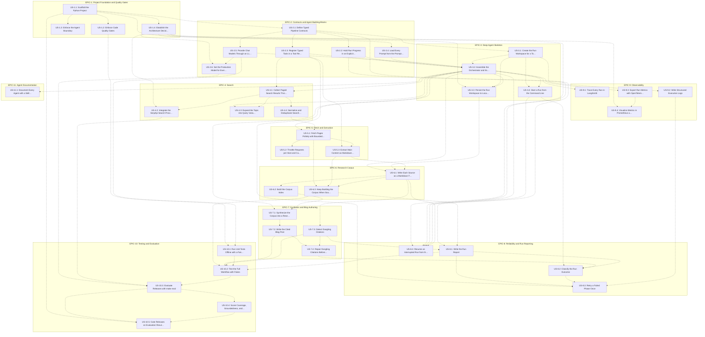

Each epic's user stories and their tasks:

### EPIC-1 stories and tasks

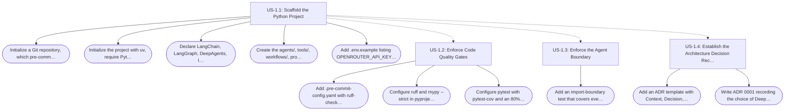

### EPIC-2 stories and tasks

```mermaid
flowchart TD
  US-2_1["US-2.1: Define Typed Pipeline Contracts"]
  US-2_1 --> US-2_1_t1(["Create schemas/requests.py with ResearchReq…"])
  US-2_1 --> US-2_1_t2(["Create schemas/responses.py with SearchResu…"])
  US-2_1 --> US-2_1_t3(["Add a Pydantic settings model for run confi…"])
  US-2_2["US-2.2: Hold Run Progress in an Explicit State…"]
  US-2_2 --> US-2_2_t1(["Create schemas/state.py with the RunState m…"])
  US-2_2 --> US-2_2_t2(["Add a DeepAgentState subclass that holds Ru…"])
  US-2_2 --> US-2_2_t3(["Have state-changing tools return validated…"])
  US-2_2 --> US-2_2_t4(["Verify that the checkpointer round-trips Ru…"])
  US-2_3["US-2.3: Register Typed Tools in a Tool Registry"]
  US-2_3 --> US-2_3_t1(["Create the TOOLS registry that maps tool na…"])
  US-2_3 --> US-2_3_t2(["Validate every tool's input and output agai…"])
  US-2_3 --> US-2_3_t3(["Add a test that fails when a registered too…"])
  US-2_4["US-2.4: Load Every Prompt from the Prompt Catal…"]
  US-2_4 --> US-2_4_t1(["Create a prompt loader and one prompt file…"])
  US-2_4 --> US-2_4_t2(["Write the orchestrator prompt from the SKIL…"])
  US-2_4 --> US-2_4_t3(["Add a test that fails when an agent module…"])
  US-2_5["US-2.5: Provide Chat Models Through an LLM Serv…"]
  US-2_5 --> US-2_5_t1(["Create services/llm_service.py returning a…"])
  US-2_5 --> US-2_5_t2(["Apply the PD-002 provider preferences to ev…"])
  US-2_5 --> US-2_5_t3(["Add per-agent model settings to the configu…"])
  US-2_6["US-2.6: Set the Production Model for Every Agent"]
  US-2_6 --> US-2_6_t1(["Record the OpenRouter and DeepSeek V4.1 Fla…"])
  US-2_6 --> US-2_6_t2(["Set the production model for every agent in…"])
  US-2_6 --> US-2_6_t3(["Add a live tool-calling smoke test for the…"])
  US-1_1["US-1.1"]
  US-1_4["US-1.4"]
  US-1_1 -.-> US-2_1
  US-2_1 -.-> US-2_2
  US-2_1 -.-> US-2_3
  US-1_1 -.-> US-2_4
  US-2_1 -.-> US-2_5
  US-1_4 -.-> US-2_6
  US-2_5 -.-> US-2_6
```

### EPIC-3 stories and tasks

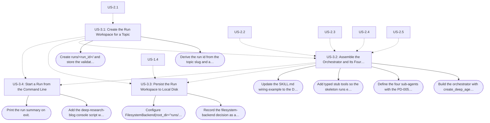

### EPIC-4 stories and tasks

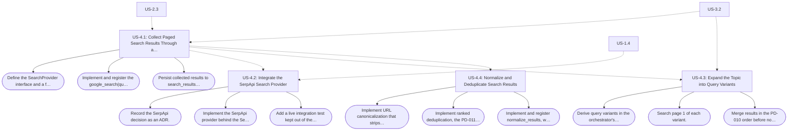

### EPIC-5 stories and tasks

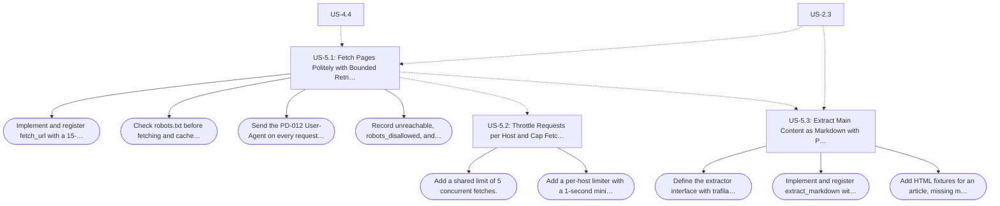

### EPIC-6 stories and tasks

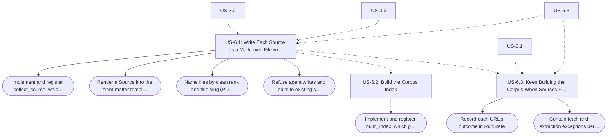

### EPIC-7 stories and tasks

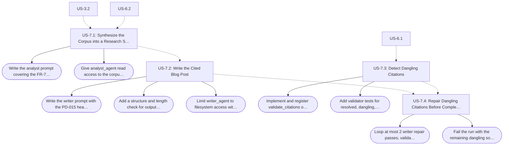

### EPIC-8 stories and tasks

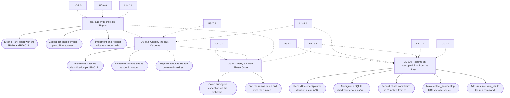

### EPIC-9 stories and tasks

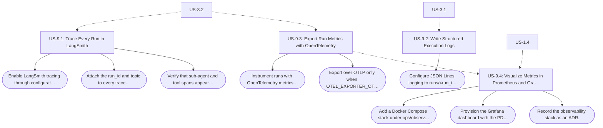

### EPIC-10 stories and tasks

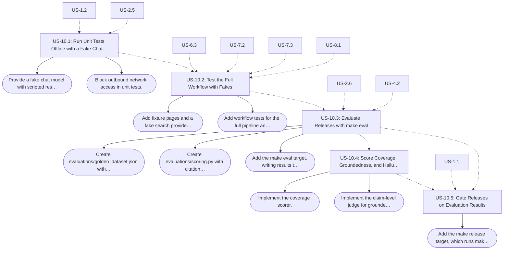

### EPIC-11 stories and tasks

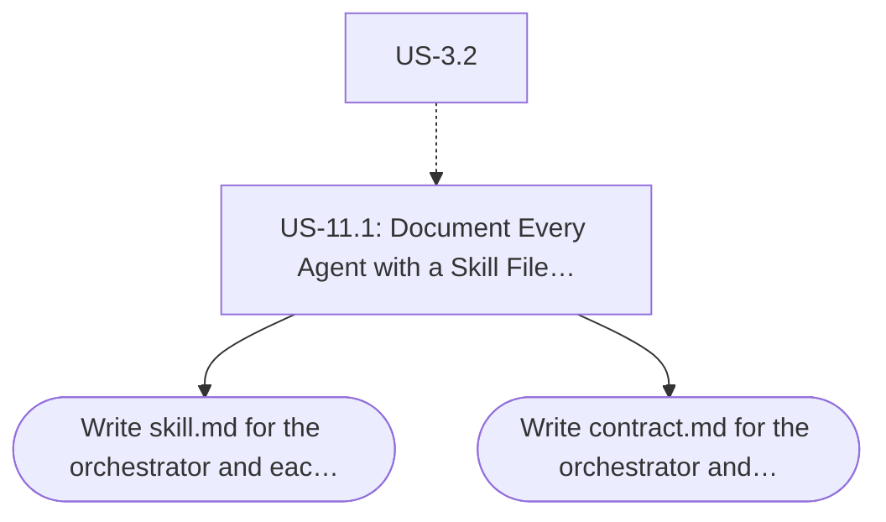

## Product Context

Deep Research Blog Writer is a DeepAgent built with LangChain `deepagents` on LangGraph. Given one research topic, it runs paged Google searches through the SerpApi API (3 pages × 10 results for the topic, plus its query variants, capped at 30 URLs), collects every result into a local Markdown source file with front-matter, indexes and synthesizes that corpus, and writes a 2000–5000 word blog post whose claims cite only those sources. All model calls go through OpenRouter to DeepSeek V4.1 Flash. Each run keeps its inputs and artifacts in its own workspace, `runs/<run_id>/`; PRD paths such as `research/` and `output/` are relative to that workspace.

The codebase follows the Product Manager's engineering standards: agents orchestrate, tools execute, services integrate, and schemas define contracts. Delivery follows the PRD milestones: skeleton (M1), ingest (M2), authoring (M3), production hardening (M4), and evaluation (M5).

Traceability sources cited by the stories below:

- `PRD.md` — Draft v1, 2026-09-30.
- `skills/deep-research-blog-writer/SKILL.md`.
- **Engineering standards** — supplied by the Product Manager in chat on 2026-09-30: Python Standards, Recommended Project Structure, DeepAgents Specific Recommendations, Documentation Standards, Testing Standards, Observability, and the recommended stack. Not yet committed to the repository.
- **Project brief** — the Product Manager's product statement, supplied in chat on 2026-09-30: search Google ("3 searches paged 10"), visit each result, convert its content to local Markdown, then write a blog post on the topic from those 30 files.
- **Product decisions PD-001 to PD-022** — made by the Product Manager on 2026-09-30 and listed under Product Decisions below. Where a decision differs from `PRD.md` or `SKILL.md`, the decision governs.

## Goals

- Turn one topic into up to 30 clean, attributable Markdown sources and a cited 2000–5000 word blog post, with no manual steps.
- Make every blog claim traceable to a corpus source, with zero dangling citations.
- Keep every run reproducible and resumable from its workspace.
- Keep agents, tools, services, schemas, and prompts separated and typed.
- Make quality measurable with offline tests and a repeatable evaluation.
- Make runs observable: tokens, latency, cost, tool calls, and retries.

## Non-Goals

- A general web agent or chatbot.
- Paid or gated content, paywall bypass, or CAPTCHA solving.
- Scraping Google result pages directly.
- Image generation or CMS publishing; the blog stays Markdown on disk.
- Multi-topic batching in v1.

## Actors

- Human Product Manager — owns product decisions
- Engineering Lead — owns the codebase standards
- Technical content author — runs the pipeline and edits the draft
- Orchestrator deep agent
- search_agent
- research_agent
- analyst_agent
- writer_agent
- SerpApi (Google search API; Serper supported as an alternate)
- Source websites
- OpenRouter (DeepSeek V4.1 Flash)
- LangSmith

## Global Business Rules

### BR-001 — Agents Orchestrate, Tools Execute

Agents MUST NOT call external systems (HTTP clients, search APIs) directly. Every external call MUST go through a registered tool.

Source: PRD.md §5; SKILL.md Operating rules, rule 1; Engineering standards, Recommended Project Structure.

### BR-002 — Typed Contracts, No Raw Dictionaries

Tool inputs and outputs, run state, configuration, and workflow contracts MUST be Pydantic v2 models. Tools MUST NOT return raw dictionaries.

Source: PRD.md §5; Engineering standards, Type Hints Everywhere and Tool Registry.

### BR-003 — Sources Are Immutable

A source file MUST NOT change after it is written.

Source: PRD.md §5.

### BR-004 — Cite Only the Corpus

Every non-obvious claim in the blog MUST carry an `[S-NN]` citation that resolves to a corpus source file. No source, no claim.

Source: PRD.md §5, FR-8, and FR-9; SKILL.md Operating rules, rule 3.

### BR-005 — One Failure Never Aborts a Run

A single URL, parser, or model failure MUST be recorded and skipped; it MUST NOT abort the run.

Source: PRD.md FR-4 and NFR-1; SKILL.md Operating rules, rule 4.

### BR-006 — The Run Workspace Holds Every Artifact

Every input and artifact of a run MUST be persisted under `runs/<run_id>/`.

Source: PRD.md FR-1 and NFR-2; SKILL.md Contract.

### BR-007 — No Gated Content and No Result-Page Scraping

The product MUST NOT bypass paywalls, solve CAPTCHAs, or scrape Google result pages. Search MUST go through a search API.

Source: PRD.md §2 and §12; SKILL.md Operating rules, rule 6.

### BR-008 — No Real Model Calls in Unit Tests

Unit tests MUST use a fake chat model and MUST NOT call a model provider, OpenRouter included.

Source: Engineering standards, Testing Standards; PD-002.

### BR-009 — Prompts Live in the Prompt Catalog

Agent prompts MUST live under `prompts/`, not inline in code.

Source: Engineering standards, "Prompts scattered everywhere" and Recommended Project Structure.

### BR-010 — Deterministic Work Never Runs Through the Model

Normalization, source collection, indexing, citation validation, and the run report MUST run as deterministic tools. Models decide which tool to call next; they MUST NOT produce those steps' output.

Source: PD-005.

## Non-Functional Requirements

### NFR-001 — Reliability

A single URL, parser, or LLM failure MUST NOT abort a run. A run is `succeeded` only when at least 80% of `max_urls` sources (24 of 30) are extracted; otherwise it is `degraded` (PD-017).

Source: PRD.md NFR-1 and §10; PD-017.

### NFR-002 — Reproducibility

All inputs and artifacts MUST be persisted under `runs/<run_id>/`, and LangGraph checkpointing MUST allow a run to resume from its last completed phase. Model IDs MUST be pinned in configuration.

Source: PRD.md NFR-2; PD-002.

### NFR-003 — Observability

Runs MUST be traced in LangSmith, MUST write structured logs to `logs/execution.log` in the run workspace, and MUST report their metrics in `output/run.json`. In production, token usage, latency, cost, tool calls, hallucination rate, and retry count MUST be tracked, using OpenTelemetry, Prometheus, and Grafana alongside LangSmith.

Source: PRD.md NFR-3; Engineering standards, Observability; PD-020.

### NFR-004 — Cost Control

Budgets MUST be enforced: at most `max_urls` (30) sources, at most 3 retries of transient fetch failures per URL, and one blog generation plus at most 2 citation-fix passes. Fetch concurrency MUST be capped and rate-limited.

Source: PRD.md NFR-4; PD-012, PD-013, and PD-016.

### NFR-005 — Politeness

Fetching MUST respect `robots.txt`, MUST send a descriptive User-Agent, and MUST throttle requests per host (PD-013).

Source: PRD.md NFR-5; PD-013.

### NFR-006 — Extensibility

The search provider, the content extractor, and each agent's model MUST be swappable through interfaces or configuration.

Source: PRD.md NFR-6; PD-002.

### NFR-007 — Code Quality

Code MUST target Python 3.12 or newer, MUST be fully type-annotated, and MUST pass ruff and `mypy --strict`. Tests MUST run with pytest and pytest-cov at 80% coverage or more, and pre-commit MUST enforce these checks.

Source: Engineering standards, Python Standards and Type Hints Everywhere; PD-001.

### NFR-008 — Evaluability

Quality MUST be measurable against a golden dataset with `make eval`, and a release MUST NOT be tagged unless the evaluation passes.

Source: Engineering standards, Testing Standards; PRD.md §11 milestone M5; PD-021.

## Product Decisions

On 2026-09-30 the Product Manager accepted the recommended default for every open decision ("use the recommendations") and chose OpenRouter with DeepSeek V4.1 Flash for every agent. Each decision below cites the story that applies it.

### PD-001 — Engineering Defaults

Total test coverage below 80% fails the build. The agent-boundary check forbids `requests`, `httpx`, `aiohttp`, `urllib3`, `urllib.request`, and `http.client` in `agents/`.

Applies to: US-1.2, US-1.3.

### PD-002 — OpenRouter with DeepSeek V4.1 Flash

All model calls go through OpenRouter with `langchain-openrouter` (`ChatOpenRouter`, key in `OPENROUTER_API_KEY`). Every agent (the orchestrator, search_agent, research_agent, analyst_agent, and writer_agent) uses DeepSeek V4.1 Flash, `deepseek/deepseek-v4.1-flash`. Every request sets the OpenRouter provider preferences `require_parameters: true`, so only providers that support tool calling receive it, and `data_collection: "deny"`. On 2026-09-30 the model listed a 1M-token context and tool support on more than 30 provider endpoints.

Applies to: US-1.1, US-2.5, US-2.6, US-10.1.

### PD-003 — Explicit State Inside DeepAgents

The run state is a Pydantic v2 model, `RunState`, stored under the `run` key of a `DeepAgentState` subclass. Tools that change it read it from `runtime.state` and return a validated replacement.

Applies to: US-2.2.

### PD-004 — Prompts Live Only in the Catalog

Every agent's system prompt lives under `prompts/`. The orchestrator's prompt carries the operating rules and workflow from `SKILL.md`, and `SKILL.md` is not loaded as a runtime skill.

Applies to: US-2.4.

### PD-005 — Deterministic Steps Run as Tools

- research_agent gets `collect_source`, which fetches one URL, extracts it, writes its source file, and returns only metadata. `fetch_url` and `extract_markdown` stay registered but are called only inside `collect_source`, not by any agent.
- The orchestrator gets `plan_search`, `normalize_results`, `build_index`, `validate_citations`, and `write_run_report`.
- search_agent gets `google_search`.
- analyst_agent and writer_agent keep only the built-in filesystem tools.

This replaces PRD.md §9's tool assignment.

Applies to: US-3.2, US-4.4, US-6.1, US-6.2, US-7.3, US-8.1.

### PD-006 — The Citation Gate Is the Review Step

v1 has no reviewer sub-agent. The deterministic citation gate is the review step, and evaluation (PD-021) measures groundedness.

Applies to: US-3.2, US-7.4.

### PD-007 — Real-Disk Workspace

The deep agent uses `FilesystemBackend(root_dir="runs/<run_id>/", virtual_mode=True)`, so each file reaches disk when it is written, and paths cannot escape the workspace.

Applies to: US-3.3.

### PD-008 — Run Command

The console script is `deep-research-blog`, invoked as `uv run deep-research-blog "<topic>"`. It takes `--pages`, `--per-page`, `--max-urls`, and `--resume <run_id>`. On exit it prints the run_id, workspace path, status, and blog path. Exit status is 0 when the run succeeds, 1 when it fails, 2 for invalid input, and 3 when it is degraded.

Applies to: US-3.4, US-8.2, US-8.4.

### PD-009 — SerpApi for Search

Search defaults to SerpApi's Google search API, with the key in `SERPAPI_API_KEY`
and `SEARCH_PROVIDER=serpapi`. The user supplied a SerpApi account/key during EPIC-4.
Use offset pagination (`start=0,10,20`) and `per_page=10`, because the current Google
API does not support `num`. Serper remains selectable with `SEARCH_PROVIDER=serper`
and its separate `SERPER_API_KEY`, behind the same provider interface.
See [ADR 0005](docs/adr/0005-search-provider.md). No application SERP scraping.

Applies to: US-4.2.

### PD-010 — Query Variants and Ranking Order

The orchestrator derives 2 or 3 variants. Search covers pages 1–3 of the topic and page 1 of each variant. Results are merged breadth-first: topic page 1, then each variant's page 1 in derivation order, then topic pages 2 and 3. Normalization keeps that order and caps the list at 30, and a URL's position in `clean_results.json` is its rank (used for file numbering in PD-014).

Applies to: US-4.3.

### PD-011 — URL Normalization Defaults

Canonicalization strips `utm_*`, `gclid`, `fbclid`, `msclkid`, `mc_cid`, and `mc_eid` parameters, fragments, and trailing slashes. The default denylist matches each of these hosts and its subdomains: facebook.com, instagram.com, x.com, twitter.com, tiktok.com, pinterest.com, reddit.com, linkedin.com, quora.com, youtube.com, youtu.be, and vimeo.com.

Applies to: US-4.4.

### PD-012 — Fetch Policy

- **Timeout:** each attempt times out after 15 seconds.
- **Retries:** only transient failures are retried: timeouts, connection errors, HTTP 429, and 5xx. They are retried up to 3 times, with exponential backoff of about 1, 2, and 4 seconds plus jitter. Other non-200 responses are recorded `unreachable` without retrying; this replaces PRD.md §10's "retry ×3" for every non-200.
- **User-Agent:** `DeepResearchBlogWriter/<version> (+<contact>)`, with the contact taken from configuration.
- **Skipped URLs:** URLs that robots.txt disallows are recorded `robots_disallowed`. Non-HTML responses, such as PDFs, are recorded `unsupported_content`. Both count as failed in `run.json`.

Applies to: US-5.1.

### PD-013 — Politeness Limits

At most 5 fetches run at once. Consecutive requests to one host start at least 1 second apart, or further apart when robots.txt sets a longer `Crawl-delay`.

Applies to: US-5.2.

### PD-014 — Source File Naming

- **Numbering:** a source's file number is its rank in `clean_results.json`, and failed ranks leave gaps. Rank 7 becomes `research/007_<slug>.md` with source_id `S-07`.
- **Slug:** the slug comes from the title: lowercase ASCII, words joined by hyphens, at most 60 characters. When the title yields no slug, it comes from the URL's host and path.

Applies to: US-6.1.

### PD-015 — Blog Structure and Length

The blog has one `#` title, followed by these sections in order: `## Introduction`, `## Landscape`, `## Key Frameworks`, `## Analysis and Trade-offs`, `## Outlook`, `## Conclusion`, and `## References`. A draft outside 2000–5000 words is kept and is not regenerated, since NFR-4 allows one generation. The run records the status reason `blog_length`.

Applies to: US-7.2.

### PD-016 — Citation Repair Limit

The writer gets at most 2 repair passes. If dangling citations remain, the run ends `failed` with reason `dangling_citations`. The last draft stays in `output/blog.md`, and `output/run.json` lists the dangling source_ids.

Applies to: US-7.4.

### PD-017 — Run Outcome Rules

- **`failed`:** search returned no results (`no_results`), no source was extracted (`no_sources`), a phase failed again after its one retry (`phase_failed`), or dangling citations remained after repair (`dangling_citations`).
- **`degraded`:** otherwise, fewer than 80% of `max_urls` sources were extracted (`too_few_sources`, fewer than 24 of 30), or the blog length is out of range (`blog_length`).
- **`succeeded`:** everything else.

Measuring 80% against `max_urls` reconciles PRD.md NFR-1 with §10, since 24 is 80% of 30. `output/run.json` records the status and every reason.

Applies to: US-8.2, US-8.3.

### PD-018 — Run Report Contents and Cost

`RunReport` carries every field from PRD.md §8 and FR-10. It also adds:

- `urls_clean`;
- `status_reasons`;
- one outcome entry per clean URL: rank, url, outcome, reason, and source_id.

The cost total is the sum of the `usage.cost` that OpenRouter returns with every response. When a response lacks it, its cost is computed from its tokens and the model's OpenRouter price.

Applies to: US-8.1.

### PD-019 — Resume with a Per-Run SQLite Checkpointer

Runs checkpoint to `runs/<run_id>/checkpoints.sqlite` through `langgraph-checkpoint-sqlite`, with the LangGraph thread_id set to the run_id. Phases remain orchestrator todos, and the tool that finishes each phase records it in `RunState`. `collect_source` skips any URL whose source file already exists. PostgreSQL, from the standards' stack, is the upgrade path when runs move to a server.

Applies to: US-8.4.

### PD-020 — Observability Defaults

- **Traces:** LangSmith traces carry the run_id and topic as metadata.
- **Logs:** each run writes JSON Lines to `runs/<run_id>/logs/execution.log`; there is no global log.
- **Metrics:** exported over OTLP to `OTEL_EXPORTER_OTLP_ENDPOINT`, and disabled when that variable is unset. They include a dangling-citation count; hallucination rate is measured only in evaluation.
- **Stack:** v1 runs locally as a CLI, and `ops/observability/` holds a Docker Compose stack of the OpenTelemetry Collector, Prometheus, and Grafana.
- **Dashboard:** Grafana's provisioned dashboard shows runs by status, tokens, cost, phase latency, tool calls, retries, URL outcomes, and dangling citations. v1 has no alerts.

Applies to: US-9.1, US-9.2, US-9.3, US-9.4.

### PD-021 — Evaluation and Release Gate

- **Golden topics:** "2026 agentic AI frameworks", "Vector databases for retrieval-augmented generation", and "Platform engineering and internal developer portals". Each `make eval` run writes its scores to `evaluations/benchmarks/<date>-<commit>.json`.
- **Scores:**
  - Coverage is the share of corpus sources cited in the blog.
  - Groundedness is the share of cited claims that a judge model finds supported by the cited source.
  - Hallucination rate is the share of factual claims that are unsupported or uncited.
- **Judge:** the judge model defaults to DeepSeek V4.1 Flash on OpenRouter, the same model the agents use.
- **Release:** `make release VERSION=x.y.z` runs `make eval` and tags `vX.Y.Z` only if every golden topic passes all of these:
  - zero dangling citations;
  - 2000–5000 words;
  - the PRD.md §13 Definition of Done;
  - coverage of at least 0.5;
  - groundedness of at least 0.9;
  - a hallucination rate of at most 0.05.

Applies to: US-10.3, US-10.4, US-10.5.

### PD-022 — Agent Documentation Format

Each agent has `docs/architecture/agents/<agent>/skill.md` and a `contract.md` beside it. Both are human documentation, not runtime skills. `skill.md` uses the senior-level template and adds Failure Modes: Purpose, Capabilities, Non-Capabilities, Inputs, Outputs, Available Tools, Security, Observability, Evaluation Criteria, Failure Modes, and Example.

Applies to: US-11.1.

---

# EPIC-1: Project Foundation and Quality Gates

## Objective

Stand up a uv-managed Python 3.12+ project with the standard package layout, automated quality gates, an enforced agent boundary, and an ADR log, so every later story lands in a typed, linted, tested, and documented codebase.

## Dependencies

None.

### US-1.1: Scaffold the Python Project

Status: DONE

As an Engineering Lead
I want a uv-managed Python 3.12+ project with the standard package layout
So that agents, tools, services, schemas, prompts, workflows, and evaluations each have one predictable home.

Source:
- Engineering standards — Python Standards (Python 3.12+) and Recommended Project Structure
- Engineering standards — recommended stack (LangChain, LangGraph, DeepAgents, Pydantic v2, uv)
- Product decision PD-002 (OpenRouter through `langchain-openrouter`)

Acceptance Criteria:

```gherkin
Scenario: Install the project with uv
  Given a fresh checkout of the repository
  When "uv sync" runs
  Then the environment MUST resolve on Python 3.12 or newer
  And "langchain", "langgraph", "deepagents", "langchain-openrouter", and "pydantic" 2.x MUST be installed
```

```gherkin
Scenario: The standard package layout exists
  Given the project has been scaffolded
  When the repository root is inspected
  Then "pyproject.toml" MUST exist
  And "agents/", "tools/", "workflows/", "prompts/", "schemas/", "services/", "evaluations/", "tests/", and "docs/" MUST exist
```

Dependencies:
- None

Tasks:
- [x] Initialize a Git repository, which pre-commit requires.
- [x] Initialize the project with `uv`, require Python 3.12 or newer, and commit `uv.lock`.
- [x] Declare LangChain, LangGraph, DeepAgents, `langchain-openrouter`, and Pydantic v2 as dependencies.
- [x] Create the `agents/`, `tools/`, `workflows/`, `prompts/`, `schemas/`, `services/`, `evaluations/`, `tests/`, and `docs/` packages.
- [x] Add `.env.example` listing `OPENROUTER_API_KEY` and `SERPER_API_KEY`, and git-ignore `.env` and `runs/`.

Open Questions:
- None.

### US-1.2: Enforce Code Quality Gates

Status: DONE

As an Engineering Lead
I want ruff, strict mypy, pytest with coverage, and pre-commit enforced on every change
So that code is linted, formatted, fully typed, and tested before it lands.

Source:
- Engineering standards — Python Standards (Code Quality list and the example `.pre-commit-config.yaml`)
- Engineering standards — Type Hints Everywhere
- Product decision PD-001 (80% coverage floor)

Acceptance Criteria:

```gherkin
Scenario: Pre-commit runs the quality hooks
  Given pre-commit is installed in the repository
  When a commit is attempted
  Then the "ruff-check", "ruff-format", and "mypy" hooks MUST run
  And the commit MUST be rejected when any hook fails
```

```gherkin
Scenario: Strict typing rejects an untyped function
  Given a function without type annotations is added to a project package
  When "mypy --strict" runs
  Then the check MUST fail and report that function
```

```gherkin
Scenario: The test suite enforces coverage
  Given the test suite exists
  When pytest runs with pytest-cov
  Then a coverage report MUST be produced
  And the run MUST fail when total coverage is below 80%
```

Dependencies:
- US-1.1

Tasks:
- [x] Add `.pre-commit-config.yaml` with `ruff-check` and `ruff-format` (ruff-pre-commit `v0.13.0`) and `mypy` (mirrors-mypy `v1.18.1`).
- [x] Configure ruff and `mypy --strict` in `pyproject.toml`.
- [x] Configure pytest with pytest-cov and an 80% coverage floor.

Open Questions:
- None.

### US-1.3: Enforce the Agent Boundary

Status: DONE

As an Engineering Lead
I want a check that fails when agent code calls external systems directly
So that agents only orchestrate and every external call goes through a registered tool.

Source:
- PRD.md §5, design rule "Agents orchestrate; tools execute" ("No agent calls `requests`/`httpx` directly")
- skills/deep-research-blog-writer/SKILL.md — Operating rules, rule 1
- Engineering standards — Recommended Project Structure ("Never let agents call external APIs directly")
- Product decision PD-001 (forbidden imports)

Acceptance Criteria:

```gherkin
Scenario: An agent module imports an HTTP client
  Given a module under "agents/" imports "requests", "httpx", "aiohttp", "urllib3", "urllib.request", or "http.client"
  When the test suite runs
  Then the boundary check MUST fail
  And it MUST name the offending module
```

```gherkin
Scenario: Agent modules without HTTP clients pass
  Given no module under "agents/" imports a forbidden HTTP client
  When the test suite runs
  Then the boundary check MUST pass
```

Dependencies:
- US-1.1

Tasks:
- [x] Add an import-boundary test that covers every module under `agents/` and the PD-001 import list.

Open Questions:
- None.

### US-1.4: Establish the Architecture Decision Record Log

Status: DONE

As an Engineering Lead
I want architecture decisions recorded as numbered ADRs under docs/adr/
So that the reasons behind the stack and each product decision stay reviewable.

Source:
- Engineering standards — Documentation Standards, ADRs (location `docs/adr/`, numbered file names, Context / Decision / Consequences structure)
- PRD.md §4 (Why DeepAgents)

Acceptance Criteria:

```gherkin
Scenario: ADRs follow the standard structure
  Given the ADR log exists under "docs/adr/"
  When any ADR is opened
  Then its file name MUST start with a zero-padded four-digit number
  And it MUST contain "Context", "Decision", and "Consequences" sections
  And "Consequences" MUST list pros and cons
```

```gherkin
Scenario: Record the decision to build on DeepAgents
  Given PRD.md §4 decides to build on DeepAgents and LangGraph
  When the ADR log is created
  Then ADR 0001 MUST record that decision and its consequences
```

Dependencies:
- US-1.1

Tasks:
- [x] Add an ADR template with Context, Decision, and Consequences (pros and cons) sections.
- [x] Write ADR 0001 recording the choice of DeepAgents on LangGraph (PRD.md §4).

Open Questions:
- None.

---

# EPIC-2: Contracts and Agent Building Blocks

## Objective

Define the typed contracts, explicit run state, tool registry, prompt catalog, and OpenRouter model service that every agent and tool builds on.

## Dependencies

- EPIC-1

### US-2.1: Define Typed Pipeline Contracts

Status: DONE

As an Engineering Lead
I want every request, tool payload, source, report, and configuration defined as a Pydantic v2 model
So that each hand-off in the pipeline is validated and documented by its type.

Source:
- PRD.md §8 (Contracts) and §9 (tool interfaces, including `FetchedPage`)
- PRD.md FR-1 (topic length and trimming)
- Engineering standards — Type Hints Everywhere (Pydantic models for agent state, tool input/output, config, and workflow contracts)

Acceptance Criteria:

```gherkin
Scenario: Reject a topic outside 3 to 250 characters
  Given a research request whose topic is shorter than 3 or longer than 250 characters after trimming
  When the request is validated
  Then validation MUST fail with an error that names the topic field
```

```gherkin
Scenario: Accept a valid topic with the default budgets
  Given a research request whose topic is "  2026 agentic AI frameworks  "
  When the request is validated
  Then the topic MUST be "2026 agentic AI frameworks"
  And pages MUST default to 3, per_page to 10, and max_urls to 30
```

```gherkin
Scenario: Contracts cover every pipeline hand-off
  Given the "schemas" package
  When its models are listed
  Then ResearchRequest, SearchResult, FetchedPage, Source, and RunReport MUST exist as Pydantic v2 models
  And each MUST include the fields PRD.md §8 and §9 list for it
```

```gherkin
Scenario: Reject invalid configuration
  Given a configuration value of the wrong type
  When the configuration is loaded
  Then loading MUST fail with an error that names the field
```

Dependencies:
- US-1.1

Tasks:
- [x] Create `schemas/requests.py` with `ResearchRequest` and its topic validation.
- [x] Create `schemas/responses.py` with `SearchResult`, `FetchedPage`, `Source`, and `RunReport`.
- [x] Add a Pydantic settings model for run configuration, read from the environment and `.env`.

Open Questions:
- None. US-8.1 extends `RunReport` with the FR-10 and PD-018 fields.

### US-2.2: Hold Run Progress in an Explicit State Model

Status: DONE

As an Engineering Lead
I want the run's progress held in a typed state model rather than implicit agent memory
So that the workflow stays deterministic, testable, and resumable.

Source:
- Engineering standards — DeepAgents Specific Recommendations, "Keep Agent State Explicit"
- PRD.md NFR-2 (resume from the last completed phase)
- PRD.md FR-10 (per-URL outcome counts)
- Product decision PD-003 (RunState inside a DeepAgentState subclass)

Acceptance Criteria:

```gherkin
Scenario: Run state validates against its model
  Given a run is in progress
  When its state is checkpointed
  Then the "run" key MUST hold a RunState that validates against its Pydantic model
  And it MUST record the topic, the completed phases, and the outcome of every clean URL
```

```gherkin
Scenario: The agent state schema carries RunState
  Given the deep agent's state schema
  When it is inspected
  Then it MUST subclass DeepAgentState
  And it MUST declare RunState under the "run" key
```

```gherkin
Scenario: Reject a malformed state update
  Given a tool returns a RunState update that sets a field to a value of the wrong type
  When the update is applied
  Then validation MUST fail
```

Dependencies:
- US-2.1

Tasks:
- [x] Create `schemas/state.py` with the `RunState` model.
- [x] Add a `DeepAgentState` subclass that holds `RunState` under the `run` key.
- [x] Have state-changing tools return validated `RunState` replacements.
- [x] Verify that the checkpointer round-trips `RunState` unchanged.

Open Questions:
- None.

### US-2.3: Register Typed Tools in a Tool Registry

Status: DONE

As an Engineering Lead
I want every tool registered with a Pydantic input model and a Pydantic output model
So that agents only receive typed tools and no tool returns a raw dictionary.

Source:
- Engineering standards — Tool Registry (`TOOLS` mapping, `ToolInput` and `ToolOutput` models, "Never return raw dictionaries")
- PRD.md §5, design rule "Tools are typed"

Acceptance Criteria:

```gherkin
Scenario: Every registered tool is typed
  Given the tool registry
  When its entries are listed
  Then every entry MUST declare a Pydantic input model and a Pydantic output model
```

```gherkin
Scenario: Reject a tool that returns a raw dictionary
  Given a registered tool whose implementation returns a plain dict
  When the tool is invoked through the registry
  Then the call MUST fail output validation
```

Dependencies:
- US-2.1

Tasks:
- [x] Create the `TOOLS` registry that maps tool names to typed tools.
- [x] Validate every tool's input and output against its models at call time.
- [x] Add a test that fails when a registered tool lacks a typed input or output model.

Open Questions:
- None.

### US-2.4: Load Every Prompt from the Prompt Catalog

Status: DONE

As an Engineering Lead
I want every agent's system prompt stored under prompts/ and loaded from there
So that prompts are reviewed and changed in one place instead of scattered through code.

Source:
- Engineering standards — "Prompts scattered everywhere" (listed among the biggest mistakes) and Recommended Project Structure (`prompts/`)
- Product decision PD-004 (the orchestrator prompt carries the SKILL.md rules)

Acceptance Criteria:

```gherkin
Scenario: Load a prompt by agent name
  Given a prompt file for "writer_agent" exists under "prompts/"
  When the prompt for "writer_agent" is requested
  Then the returned prompt MUST be the content of that file
```

```gherkin
Scenario: The orchestrator prompt carries the operating rules
  Given the orchestrator prompt under "prompts/"
  When it is read
  Then it MUST contain the operating rules and workflow from "skills/deep-research-blog-writer/SKILL.md"
  And the deep agent MUST NOT load "SKILL.md" as a runtime skill
```

```gherkin
Scenario: No inline prompts in agent code
  Given the modules under "agents/"
  When the test suite runs
  Then agent modules MUST NOT pass inline string literals as system prompts
```

Dependencies:
- US-1.1

Tasks:
- [x] Create a prompt loader and one prompt file per agent under `prompts/`.
- [x] Write the orchestrator prompt from the SKILL.md operating rules and workflow.
- [x] Add a test that fails when an agent module passes an inline system prompt.

Open Questions:
- None.

### US-2.5: Provide Chat Models Through an LLM Service

Status: DONE

As an Engineering Lead
I want every agent to get its OpenRouter chat model from one LLM service, configured per agent
So that models change without touching agent code and tests can inject a fake model.

Source:
- Engineering standards — Recommended Project Structure (`services/llm_service.py`, "Services integrate")
- Engineering standards — Testing Standards ("Mock LLMs")
- Product decision PD-002 (OpenRouter, provider preferences)

Acceptance Criteria:

```gherkin
Scenario: Resolve each agent's model from configuration
  Given the configuration assigns an OpenRouter model id to each agent
  When the LLM service is asked for an agent's model
  Then it MUST return a ChatOpenRouter model for that agent's configured model id
```

```gherkin
Scenario: Apply the OpenRouter provider preferences
  Given the LLM service has built a model for any agent
  When the model sends a request
  Then the request MUST set the provider preferences "require_parameters" to true and "data_collection" to "deny"
```

```gherkin
Scenario: Agent code never constructs a provider client
  Given the modules under "agents/"
  When the test suite runs
  Then agent modules MUST NOT construct provider chat-model clients directly
```

```gherkin
Scenario: Inject a fake model
  Given a test configures the LLM service with a fake chat model
  When an agent requests its model
  Then the fake chat model MUST be returned
```

Dependencies:
- US-2.1

Tasks:
- [x] Create `services/llm_service.py` returning a `ChatOpenRouter` for each agent's configured model.
- [x] Apply the PD-002 provider preferences to every request.
- [x] Add per-agent model settings to the configuration model.

Open Questions:
- None.

### US-2.6: Set the Production Model for Every Agent

Status: DONE

As a Product Manager
I want the production model set and recorded for every agent
So that runs have predictable quality and cost.

Source:
- PRD.md §12 — Model (DeepSeek V4.1 Flash through OpenRouter for every agent)
- Engineering standards — ADRs (example provider ADR)
- Product decision PD-002 (DeepSeek V4.1 Flash through OpenRouter)

Acceptance Criteria:

```gherkin
Scenario: Production configuration pins every agent's model
  Given the production configuration
  When it is loaded
  Then the orchestrator, search_agent, research_agent, analyst_agent, and writer_agent MUST all use "openrouter:deepseek/deepseek-v4.1-flash"
  And an ADR MUST record the provider and model choices
```

```gherkin
Scenario: The production model completes a tool call
  Given "OPENROUTER_API_KEY" is set
  When the live smoke test sends one tool-calling request through the production model
  Then the model MUST return a valid tool call
```

Dependencies:
- US-1.4
- US-2.5

Tasks:
- [x] Record the OpenRouter and DeepSeek V4.1 Flash decision as an ADR.
- [x] Set the production model for every agent in configuration.
- [x] Add a live tool-calling smoke test for the model, kept out of the offline unit suite.

Open Questions:
- None.

---

# EPIC-3: Deep Agent Skeleton

## Objective

Wire the orchestrator deep agent and its four sub-agents end to end with typed stub tools (PRD.md milestone M1), give every run its own workspace on local disk, and start runs from one command.

## Dependencies

- EPIC-1
- EPIC-2

### US-3.1: Create the Run Workspace for a Topic

Status: DONE

As a technical content author
I want each run to get its own identifier and workspace
So that every artifact of a run stays together and traceable.

Source:
- PRD.md FR-1 (run id and `runs/<run_id>/`)
- PRD.md NFR-2 (all inputs and artifacts persisted under `runs/<run_id>/`)

Acceptance Criteria:

```gherkin
Scenario: Derive the run id and create the workspace
  Given a valid research request for the topic "2026 agentic AI frameworks"
  When a run starts
  Then the run id MUST be the slug of the topic, a hyphen, and a UTC timestamp
  And the directory "runs/<run_id>/" MUST be created
```

```gherkin
Scenario: Persist the run input
  Given a run has started
  When its workspace is inspected
  Then the validated research request MUST be stored in "runs/<run_id>/"
```

```gherkin
Scenario: An invalid topic starts no run
  Given a research request whose topic fails validation
  When a run is requested
  Then the run MUST NOT start
  And a new directory MUST NOT be created under "runs/"
```

Dependencies:
- US-2.1

Tasks:
- [x] Derive the run id from the topic slug and a UTC timestamp.
- [x] Create `runs/<run_id>/` and store the validated request in it.

Open Questions:
- None.

### US-3.2: Assemble the Orchestrator and Its Four Sub-Agents

Status: DONE

As an Engineering Lead
I want the orchestrator deep agent wired with search_agent, research_agent, analyst_agent, and writer_agent
So that every later phase plugs into a working skeleton with isolated sub-agent contexts.

Source:
- PRD.md §4 (Why DeepAgents), §5 (Architecture), §9 (Sub-agents & Tools), and §11 milestone M1
- skills/deep-research-blog-writer/SKILL.md — Sub-agents & tools, Workflow, and Operating rules, rule 2
- Product decisions PD-005 (tool assignment) and PD-006 (no reviewer sub-agent)

Acceptance Criteria:

```gherkin
Scenario: Register the four sub-agents with their tools
  Given the deep agent is built
  When its sub-agents are listed
  Then "search_agent", "research_agent", "analyst_agent", and "writer_agent" MUST be registered
  And search_agent MUST have "google_search" and research_agent MUST have "collect_source"
  And each agent's system prompt MUST come from the prompt catalog
```

```gherkin
Scenario: The orchestrator holds the deterministic tools
  Given the deep agent is built
  When the orchestrator's tools are listed
  Then they MUST include "normalize_results", "build_index", "validate_citations", and "write_run_report"
  And they MUST NOT include "fetch_url", "extract_markdown", or "collect_source"
```

```gherkin
Scenario: Raw pages stay out of every model context
  Given a run whose stub fetch returns HTML containing a unique marker
  When the run completes
  Then the marker MUST NOT appear in any agent's messages
```

```gherkin
Scenario: Plan the run as todos
  Given a run starts for a valid topic
  When the orchestrator plans the run
  Then it MUST record the pipeline phases as todos with "write_todos"
```

```gherkin
Scenario: Run the skeleton end to end
  Given every pipeline tool is a stub that returns fixed typed output
  And the chat model is a fake
  When the deep agent is invoked with a valid topic
  Then the invocation MUST complete without error
```

Dependencies:
- US-2.2
- US-2.3
- US-2.4
- US-2.5
- US-3.1

Tasks:
- [x] Build the orchestrator with `create_deep_agent`, using the prompt catalog and the LLM service.
- [x] Define the four sub-agents with the PD-005 tool assignment.
- [x] Add typed stub tools so the skeleton runs end to end.
- [x] Update the SKILL.md wiring example to the DeepAgents 0.7 API (`system_prompt`).

Open Questions:
- None.

### US-3.3: Persist the Run Workspace to Local Disk

Status: DONE

As a technical content author
I want every file the agents write to land on local disk under `runs/<run_id>/`
So that the corpus and the blog survive the process and I can open them locally.

Source:
- PRD.md §12, Open decisions — FS backend (real-disk backend recommended)
- PRD.md FR-1 and NFR-2 (artifacts under `runs/<run_id>/`)
- Project brief ("once the 30 md files are local")
- Product decision PD-007 (FilesystemBackend with virtual_mode)

Acceptance Criteria:

```gherkin
Scenario: Agent files reach local disk as they are written
  Given a run with run id "<run_id>"
  When an agent writes "research/summary.md" with the filesystem tools
  Then the file MUST exist on local disk at "runs/<run_id>/research/summary.md" before the agent's next step
```

```gherkin
Scenario: Writes outside the workspace are refused
  Given an agent tries to write a path that resolves outside "runs/<run_id>/"
  When the filesystem tool handles the write
  Then the write MUST be refused
```

Dependencies:
- US-1.4
- US-3.1
- US-3.2

Tasks:
- [x] Record the filesystem-backend decision as an ADR.
- [x] Configure `FilesystemBackend(root_dir="runs/<run_id>/", virtual_mode=True)` for the deep agent.

Open Questions:
- None.

### US-3.4: Start a Run from the Command Line

Status: DONE

As a technical content author
I want to start a run with one command and a topic string
So that producing a researched draft takes nothing beyond the topic.

Source:
- PRD.md §1 ("one command — a topic string — produces…")
- PRD.md FR-1 (reject invalid topics with a clear error)
- Product decision PD-008 (run command)

Acceptance Criteria:

```gherkin
Scenario: Start a run with a topic
  Given the project is installed
  When "deep-research-blog" runs with the topic "2026 agentic AI frameworks"
  Then a run MUST start for that topic
  And on exit the command MUST print the run_id, the workspace path, the status, and the blog path
```

```gherkin
Scenario: Override the budgets
  Given the project is installed
  When "deep-research-blog" runs with "--pages 2 --per-page 5 --max-urls 10" and a valid topic
  Then the run MUST use 2 pages, 5 results per page, and at most 10 URLs
```

```gherkin
Scenario: Reject an invalid topic
  Given the project is installed
  When "deep-research-blog" runs with an empty topic
  Then it MUST exit with status 2 and an error that explains the topic rule
  And a run MUST NOT start
```

Dependencies:
- US-3.1
- US-3.2

Tasks:
- [x] Add the `deep-research-blog` console script with `--pages`, `--per-page`, and `--max-urls`.
- [x] Print the run summary on exit.

Open Questions:
- None.

---

# EPIC-4: Search

## Objective

Turn a validated topic into a ranked, deduplicated list of up to 30 article URLs from paged Google results obtained through SerpApi (PRD.md milestone M2).

Implementation and acceptance evidence: [EPIC-4.md](docs/SPECS-LOGS/EPIC-4.md), [EPIC-4-RUNBOOK.md](docs/SPECS-LOGS/EPIC-4-RUNBOOK.md), and [docs/evidence/epic-4/](docs/evidence/epic-4/).

## Dependencies

- EPIC-1
- EPIC-2
- EPIC-3

### US-4.1: Collect Paged Search Results Through a Provider Interface

Status: DONE

As a technical content author
I want my topic searched across 3 result pages of 10
So that the run gathers up to 30 candidate sources for the topic.

Source:
- PRD.md FR-2
- PRD.md NFR-6 (search provider swappable behind an interface)
- skills/deep-research-blog-writer/SKILL.md — Workflow step 2
- Project brief ("search google (3 searches paged 10)")

Acceptance Criteria:

```gherkin
Scenario: Page through the topic's results
  Given pages is 3 and per_page is 10
  And the provider has more than 30 results for the topic
  When the search phase runs
  Then "google_search" MUST be called for pages 1, 2, and 3 of the topic query
  And at most 30 results MUST be collected for the topic query
```

```gherkin
Scenario: Persist raw search results
  Given the search phase has completed
  When "search_results.json" is read from the run workspace
  Then every collected result MUST record its query, rank, url, title, and snippet
```

```gherkin
Scenario: Swap the search provider
  Given a second implementation of the search provider interface
  When the configuration selects it
  Then "google_search" MUST return that provider's results without changes to any agent
```

Dependencies:
- US-2.3
- US-3.2

Tasks:
- [x] Define the `SearchProvider` interface and a fake provider for tests.
- [x] Implement and register the `google_search(query, page)` tool.
- [x] Persist collected results to `search_results.json`.

Open Questions:
- None.

### US-4.2: Integrate the SerpApi Search Provider

Status: DONE

As a Product Manager
I want SerpApi integrated as the production search provider
So that runs return real Google results without scraping result pages.

Source:
- PRD.md §12, Open decisions — Search provider (Serper.dev originally recommended; SerpApi selected in EPIC-4)
- PRD.md FR-2 ("v1: Serper/SerpAPI or Tavily")
- skills/deep-research-blog-writer/SKILL.md — Operating rules, rule 6
- Product decision PD-009 (SerpApi, `SERPAPI_API_KEY`)

Acceptance Criteria:

```gherkin
Scenario: Search through SerpApi
  Given "SERPAPI_API_KEY" is set
  When "google_search" is called for page 2 of a query with per_page 10
  Then the results SerpApi ranks 11 to 20 for that query MUST be returned as SearchResult items
  And Google result pages MUST NOT be fetched or parsed directly
```

```gherkin
Scenario: Missing credentials fail before searching
  Given "SERPAPI_API_KEY" is not set
  When a run starts with the SerpApi provider
  Then the run MUST fail before any search with an error that names "SERPAPI_API_KEY"
```

Dependencies:
- US-1.4
- US-4.1

Tasks:
- [x] Record the SerpApi decision as an ADR.
- [x] Implement the SerpApi provider behind the `SearchProvider` interface, reading `SERPAPI_API_KEY`.
- [x] Add a live integration test kept out of the offline unit suite.

Open Questions:
- None.

### US-4.3: Expand the Topic into Query Variants

Status: DONE

As a technical content author
I want 2–3 query variants derived from my topic
So that the corpus covers the topic beyond a single phrasing.

Source:
- PRD.md FR-2 ("plus 2–3 planner-derived query variants")
- skills/deep-research-blog-writer/SKILL.md — Workflow step 1
- Product decision PD-010 (search budget and merge order)

Acceptance Criteria:

```gherkin
Scenario: Derive query variants
  Given a valid topic
  When the orchestrator plans the run
  Then it MUST derive 2 or 3 query variants in addition to the topic
  And each result found by a variant MUST record that variant as its query in "search_results.json"
```

```gherkin
Scenario: Search the first page of each variant
  Given the topic and its derived variants
  When the search phase runs
  Then "google_search" MUST be called for page 1 of each variant, in addition to pages 1 to 3 of the topic
```

```gherkin
Scenario: Merge results breadth-first
  Given results from the topic and its variants
  When they are merged for normalization
  Then the order MUST be topic page 1, then page 1 of each variant in derivation order, then topic pages 2 and 3
```

Dependencies:
- US-3.2
- US-4.1

Tasks:
- [x] Derive query variants in the orchestrator's plan phase.
- [x] Search page 1 of each variant.
- [x] Merge results in the PD-010 order before normalization.

Open Questions:
- None.

### US-4.4: Normalize and Deduplicate Search Results

Status: DONE

As a technical content author
I want duplicate, tracking, and non-article URLs removed before fetching
So that the budget is spent on distinct, readable sources.

Source:
- PRD.md FR-3
- skills/deep-research-blog-writer/SKILL.md — Workflow step 3
- Product decisions PD-005 (`normalize_results` tool) and PD-011 (tracking parameters and denylist)

Acceptance Criteria:

```gherkin
Scenario: Strip tracking parameters, fragments, and trailing slashes
  Given a search result for "https://example.com/post/?utm_source=x&gclid=y&id=7#intro"
  When results are normalized
  Then its canonical URL MUST be "https://example.com/post?id=7"
```

```gherkin
Scenario: Keep the best-ranked duplicate
  Given two results whose URLs share a canonical URL
  When results are normalized
  Then only the earlier-ranked result MUST remain
```

```gherkin
Scenario: Drop denylisted hosts and their subdomains
  Given the default host denylist
  When a result for "https://www.youtube.com/watch?v=abc" is normalized
  Then that result MUST be dropped
```

```gherkin
Scenario: Keep ranking order and apply the cap
  Given more than max_urls results remain after deduplication and filtering
  When results are normalized
  Then the first max_urls results in ranking order MUST be kept
  And they MUST be written to "clean_results.json" in that order
```

Dependencies:
- US-4.1

Tasks:
- [x] Implement URL canonicalization that strips the PD-011 tracking parameters, fragments, and trailing slashes.
- [x] Implement ranked deduplication, the PD-011 default denylist with subdomain matching, and the `max_urls` cap.
- [x] Implement and register `normalize_results`, which writes `clean_results.json` to the run workspace.

Open Questions:
- None.

---

# EPIC-5: Fetch and Extraction

## Objective

Fetch every clean URL politely and reliably, and extract each page's main content, metadata, and word count as Markdown (PRD.md milestone M2).

## Dependencies

- EPIC-2
- EPIC-4

### US-5.1: Fetch Pages Politely with Bounded Retries

Status: DONE

As a technical content author
I want each URL fetched with a timeout, bounded retries, robots.txt compliance, and an identifying User-Agent
So that transient failures recover, dead links never stall the run, and source sites are respected.

Source:
- PRD.md FR-4 ("timeout, retries=3, backoff")
- PRD.md §9 (`fetch_url` returns html, status, and final_url)
- PRD.md §10 (URL unreachable or non-200)
- PRD.md NFR-5 (robots.txt and a descriptive User-Agent)
- Product decision PD-012 (fetch policy)

Acceptance Criteria:

```gherkin
Scenario: Fetch a page
  Given a URL that redirects and then responds with status 200
  When "fetch_url" is called
  Then it MUST return the HTML, the status code, and the final URL after redirects
```

```gherkin
Scenario: Time out a slow response
  Given a URL that does not respond within 15 seconds
  When "fetch_url" is called
  Then the attempt MUST be abandoned and treated as a transient failure
```

```gherkin
Scenario: Recover from a transient failure
  Given a URL that times out once and then responds with status 200
  When "fetch_url" is called
  Then the page MUST be returned after a backoff delay
```

```gherkin
Scenario: Give up after 3 retries
  Given a URL that times out, fails to connect, or returns 429 or a 5xx status on every attempt
  When the URL is fetched
  Then it MUST be retried no more than 3 times, with exponential backoff
  And it MUST be recorded as "unreachable"
  And the next URL MUST be fetched
```

```gherkin
Scenario: Do not retry a permanent failure
  Given a URL that returns status 404
  When the URL is fetched
  Then it MUST NOT be retried
  And it MUST be recorded as "unreachable"
```

```gherkin
Scenario: Skip a URL disallowed by robots.txt
  Given a site's robots.txt disallows a clean URL for the crawler's User-Agent
  When the fetch phase reaches that URL
  Then the URL MUST NOT be fetched
  And it MUST be recorded as "robots_disallowed"
```

```gherkin
Scenario: Skip non-HTML content
  Given a URL whose response has the content type "application/pdf"
  When the URL is fetched
  Then it MUST be recorded as "unsupported_content"
  And it MUST NOT be extracted
```

```gherkin
Scenario: Identify the crawler
  Given the configured crawler contact
  When any fetch request is sent
  Then it MUST carry the User-Agent "DeepResearchBlogWriter/<version> (+<contact>)"
```

Dependencies:
- US-2.3
- US-4.4

Tasks:
- [x] Implement and register `fetch_url` with a 15-second timeout and up to 3 retries of transient failures (backoff of about 1, 2, and 4 seconds, with jitter).
- [x] Check robots.txt before fetching and cache it per host.
- [x] Send the PD-012 User-Agent on every request, with the contact read from configuration.
- [x] Record `unreachable`, `robots_disallowed`, and `unsupported_content` outcomes with their reason.

Open Questions:
- None.

### US-5.2: Throttle Requests per Host and Cap Fetch Concurrency

Status: DONE

As a Product Manager
I want fetches rate-limited per host and concurrency capped
So that runs stay polite to source sites and within cost limits.

Source:
- PRD.md NFR-4 ("Fetch concurrency capped and rate-limited")
- PRD.md NFR-5 ("throttle per host")
- Product decision PD-013 (politeness limits)

Acceptance Criteria:

```gherkin
Scenario: Cap concurrent fetches
  Given 30 clean URLs on different hosts
  When they are fetched
  Then the number of fetches in flight MUST NOT exceed 5
```

```gherkin
Scenario: Space requests to one host
  Given several clean URLs share one host
  When they are fetched
  Then consecutive requests to that host MUST start at least 1 second apart
```

```gherkin
Scenario: Honor a longer Crawl-delay
  Given a host whose robots.txt sets "Crawl-delay: 5"
  When several of its URLs are fetched
  Then consecutive requests to that host MUST start at least 5 seconds apart
```

Dependencies:
- US-5.1

Tasks:
- [x] Add a shared limit of 5 concurrent fetches.
- [x] Add a per-host limiter with a 1-second minimum interval that honors a longer `Crawl-delay`.

Open Questions:
- None.

### US-5.3: Extract Main Content as Markdown with Parser Fallback

Status: DONE

As a technical content author
I want each page's main article extracted to Markdown with its metadata
So that the corpus holds clean, attributable text instead of page chrome.

Source:
- PRD.md FR-4
- PRD.md §8 (`Source`: author and published are optional)
- PRD.md §10 (extraction empty or thin)
- PRD.md NFR-6 (extractor swappable behind an interface)

Acceptance Criteria:

```gherkin
Scenario: Extract an article
  Given a fetched HTML article page with a title, an author, and a publication date
  When "extract_markdown" runs
  Then it MUST return the title, author, published date, canonical URL, Markdown body, and word count
  And the body MUST contain the article's main text and exclude the page's navigation and footer
```

```gherkin
Scenario: Missing metadata
  Given a fetched page with no identifiable author or publication date
  When "extract_markdown" runs
  Then author and published MUST be null
  And extraction MUST still succeed
```

```gherkin
Scenario: Fall back on an empty or thin result
  Given trafilatura returns an empty body or one under 200 words
  When "extract_markdown" runs
  Then readability-lxml MUST be tried next
  And beautifulsoup4 MUST be tried if readability-lxml also returns an empty body or one under 200 words
```

```gherkin
Scenario: Skip a thin page
  Given every parser returns a body under 200 words
  When extraction completes
  Then the URL MUST be recorded as "too_thin"
  And a source file MUST NOT be written for it
```

```gherkin
Scenario: Swap the extractor
  Given an alternative implementation of the extractor interface
  When the configuration selects it
  Then "extract_markdown" MUST use it without changes to any agent
```

Dependencies:
- US-2.3
- US-5.1

Tasks:
- [x] Define the extractor interface with trafilatura, readability-lxml, and beautifulsoup4 implementations.
- [x] Implement and register `extract_markdown` with the fallback chain and the 200-word threshold.
- [x] Add HTML fixtures for an article, missing metadata, a boilerplate-heavy page, and a thin page.

Open Questions:
- None.

---

# EPIC-6: Research Corpus

## Objective

Collect every extracted page into an immutable, rank-numbered Markdown source with front-matter, index the corpus, and keep building it when individual sources fail (PRD.md milestone M2).

## Dependencies

- EPIC-3
- EPIC-5

### US-6.1: Write Each Source as a Markdown File with Front-Matter

Status: READY

As a technical content author
I want one rank-numbered Markdown file per extracted source
So that every source is readable, attributable, and citable by its source id.

Source:
- PRD.md FR-5
- PRD.md §5, design rule "Sources are immutable"
- skills/deep-research-blog-writer/SKILL.md — Source file format
- Project brief ("convert it locally to md")
- Product decisions PD-005 (`collect_source` writes the file) and PD-014 (numbering and slugs)

Acceptance Criteria:

```gherkin
Scenario: Collect a source
  Given the clean URL at rank 7 in "clean_results.json"
  When research_agent calls "collect_source" for it
  Then "research/007_<slug>.md" MUST be written in the run workspace
  And the tool MUST return only the source_id, path, title, and word_count, without the page body
```

```gherkin
Scenario: Numbers follow rank and keep gaps
  Given the clean URL at rank 3 failed and the URL at rank 4 was extracted
  When the corpus is written
  Then a source file numbered 003 MUST NOT exist
  And the rank-4 source MUST be written as "research/004_<slug>.md" with source_id "S-04"
```

```gherkin
Scenario: Front-matter and body follow the source format
  Given a source file has been written
  When it is read
  Then its front-matter MUST contain source_id, url, title, author, published, fetched as a UTC timestamp, and word_count
  And its body MUST start with the title as a level-1 heading, followed by the extracted Markdown body unchanged
```

```gherkin
Scenario: Slug from the title
  Given a source titled "LangGraph vs CrewAI: A 2026 Comparison"
  When its file is named
  Then the slug MUST be "langgraph-vs-crewai-a-2026-comparison"
```

```gherkin
Scenario: Slug fallback
  Given a source whose title yields no ASCII slug
  When its file is named
  Then the slug MUST come from the URL's host and path
```

```gherkin
Scenario: Sources are immutable
  Given a source file has been written
  When any agent tries to write or edit that file
  Then the attempt MUST be refused
  And the file MUST remain unchanged
```

Dependencies:
- US-3.2
- US-3.3
- US-5.3

Tasks:
- [ ] Implement and register `collect_source`, which fetches, extracts, writes one source file, and returns metadata only.
- [ ] Render a `Source` into the front-matter template and Markdown body.
- [ ] Name files by clean rank and title slug (PD-014).
- [ ] Refuse agent writes and edits to existing source files.

Open Questions:
- None.

### US-6.2: Build the Corpus Index

Status: READY

As a technical content author
I want an index of every source in the corpus
So that I can trace each source id to its title, host, size, and URL.

Source:
- PRD.md FR-6
- skills/deep-research-blog-writer/SKILL.md — Workflow step 5
- Product decision PD-005 (`build_index` tool)

Acceptance Criteria:

```gherkin
Scenario: Index every written source
  Given the corpus contains written source files
  When "build_index" runs
  Then "research/index.md" MUST contain a table with the columns source_id, title, host, word_count, and url
  And it MUST contain exactly one row per source file
```

```gherkin
Scenario: Index rows match the source files
  Given a source file whose front-matter has source_id "S-03"
  When "build_index" runs
  Then the "S-03" row MUST show that file's title, word_count, and url, and the host of that url
```

Dependencies:
- US-6.1

Tasks:
- [ ] Implement and register `build_index`, which generates `research/index.md` from source-file front-matter.

Open Questions:
- None.

### US-6.3: Keep Building the Corpus When Sources Fail

Status: READY

As a technical content author
I want failed sources recorded and skipped instead of stopping the run
So that one dead link or thin page never costs me the whole corpus.

Source:
- PRD.md FR-4 ("Never abort the run on one failure")
- PRD.md NFR-1 (a single URL, parser, or LLM failure never aborts the run)
- PRD.md §10 (Failure handling)
- skills/deep-research-blog-writer/SKILL.md — Operating rules, rule 4, and Failure handling

Acceptance Criteria:

```gherkin
Scenario: Continue past failed sources
  Given 30 clean URLs where one is unreachable and one extracts as thin
  When the ingest phases run
  Then 28 source files MUST be written
  And the two failed URLs MUST be recorded with the outcomes "unreachable" and "too_thin"
  And the run MUST continue to the synthesis phase
```

```gherkin
Scenario: Contain a parser exception
  Given extraction raises an exception for one URL
  When the ingest phases run
  Then that URL MUST be recorded as "failed", with the error
  And the remaining URLs MUST still be processed
```

Dependencies:
- US-5.1
- US-5.3
- US-6.1

Tasks:
- [ ] Record each URL's outcome in `RunState`.
- [ ] Contain fetch and extraction exceptions per URL inside `collect_source`.

Open Questions:
- None.

---

# EPIC-7: Synthesis and Blog Authoring

## Objective

Synthesize the corpus into themes and an outline, write a long-form blog post grounded only in the corpus, and prove every citation resolves (PRD.md milestone M3).

## Dependencies

- EPIC-3
- EPIC-6

### US-7.1: Synthesize the Corpus into a Research Summary

Status: READY

As a technical content author
I want the analyst to distill the whole corpus into themes and an outline
So that the blog builds on patterns across sources, not on any single page.

Source:
- PRD.md FR-7
- skills/deep-research-blog-writer/SKILL.md — Workflow step 6

Acceptance Criteria:

```gherkin
Scenario: Write the research summary
  Given the corpus and its index are complete
  When analyst_agent runs
  Then "research/summary.md" MUST identify recurring themes, named frameworks or vendors, points of agreement and disagreement, gaps, and a suggested outline
```

```gherkin
Scenario: Themes cite their sources
  Given "research/summary.md" has been written
  When its themes are inspected
  Then every theme MUST reference at least one source_id
  And every referenced source_id MUST belong to a source file in the corpus
```

```gherkin
Scenario: The analyst reads the whole corpus
  Given the corpus contains N source files
  When analyst_agent runs
  Then it MUST read all N source files
```

Dependencies:
- US-3.2
- US-6.2

Tasks:
- [ ] Write the analyst prompt covering the FR-7 summary contents.
- [ ] Give analyst_agent read access to the corpus and write access to `research/summary.md`.

Open Questions:
- None.

### US-7.2: Write the Cited Blog Post

Status: READY

As a technical content author
I want a 2000–5000 word blog post written only from the corpus and its summary
So that I get a first draft whose claims I can verify.

Source:
- PRD.md FR-8
- PRD.md NFR-4 (blog generated once)
- PRD.md §5, design rule "The writer cites only from the corpus"
- skills/deep-research-blog-writer/SKILL.md — Workflow step 7, and Operating rules, rules 2 and 3
- Project brief ("create a blog post with that data topic/goal")
- Product decision PD-015 (fixed headings and the length rule)

Acceptance Criteria:

```gherkin
Scenario: Write the blog in the required structure
  Given the corpus and "research/summary.md" are complete
  When writer_agent runs
  Then "output/blog.md" MUST contain between 2000 and 5000 words
  And its headings MUST be one "#" title followed by "## Introduction", "## Landscape", "## Key Frameworks", "## Analysis and Trade-offs", "## Outlook", "## Conclusion", and "## References", in that order
```

```gherkin
Scenario: Cite sources inline and list them
  Given "output/blog.md" has been written
  When its citations are inspected
  Then citations MUST use the inline form "[S-NN]"
  And "## References" MUST list every cited source_id with its title and URL
```

```gherkin
Scenario: Keep an out-of-range draft
  Given the draft has fewer than 2000 or more than 5000 words
  When the writing phase completes
  Then the draft MUST be kept without regeneration
  And the run MUST record the status reason "blog_length"
```

```gherkin
Scenario: The writer reads only clean sources
  Given writer_agent is running
  When it gathers material
  Then it MUST read only files under "research/" in the run workspace
```

```gherkin
Scenario: Generate the draft once
  Given a run reaches the writing phase
  When the writing phase completes
  Then writer_agent MUST have generated the draft exactly once, not counting citation repair passes
```

Dependencies:
- US-7.1

Tasks:
- [ ] Write the writer prompt with the PD-015 headings, the length range, and the citation rules.
- [ ] Add a structure and length check for `output/blog.md` that records `blog_length`.
- [ ] Limit writer_agent to filesystem access within the run workspace.

Open Questions:
- None. Evaluation scores FR-8's "every non-obvious claim carries a citation" (US-10.4).

### US-7.3: Detect Dangling Citations

Status: READY

As a technical content author
I want every citation in the blog checked against the corpus
So that no reference in the draft points to a source that does not exist.

Source:
- PRD.md FR-9 ("validate every `[S-NN]` in the blog resolves to an existing source file")
- PRD.md FR-8 (References section) and FR-10 (citation count)
- skills/deep-research-blog-writer/SKILL.md — Workflow step 8
- Product decision PD-005 (`validate_citations` tool)

Acceptance Criteria:

```gherkin
Scenario: All citations resolve
  Given every "[S-NN]" in "output/blog.md" matches the source_id of a source file
  When "validate_citations" runs
  Then validation MUST pass
  And it MUST report the number of citations checked
```

```gherkin
Scenario: Report a dangling citation
  Given "output/blog.md" cites "[S-31]" and no source file has source_id "S-31"
  When "validate_citations" runs
  Then validation MUST fail
  And it MUST report "S-31" as dangling
```

```gherkin
Scenario: References must match the cited sources
  Given a cited source_id is missing from "## References" or is listed with a URL other than its source file's url
  When "validate_citations" runs
  Then validation MUST fail and report the mismatch
```

Dependencies:
- US-6.1

Tasks:
- [ ] Implement and register `validate_citations` over `output/blog.md` and source-file front-matter.
- [ ] Add validator tests for resolved, dangling, and mismatched citations.

Open Questions:
- None.

### US-7.4: Repair Dangling Citations Before Completion

Status: READY

As a technical content author
I want dangling citations fixed or removed before a run is called done
So that the final draft never cites a source outside the corpus.

Source:
- PRD.md FR-9 ("the writer is re-invoked to fix or drop it"; not done "until zero dangling citations remain")
- PRD.md NFR-4 ("at most N citation-fix passes")
- PRD.md §10 (dangling citation)
- Product decisions PD-006 (the citation gate is the review step) and PD-016 (two repair passes)

Acceptance Criteria:

```gherkin
Scenario: Re-invoke the writer for dangling citations
  Given citation validation reports dangling citations
  When the citation gate runs
  Then writer_agent MUST be re-invoked with the dangling source_ids to fix or drop them
  And validation MUST run again after each pass
```

```gherkin
Scenario: Stop after two repair passes
  Given dangling citations remain after 2 repair passes
  When the citation gate ends
  Then the run MUST end with status "failed" and reason "dangling_citations"
  And "output/blog.md" MUST keep the last draft
  And "output/run.json" MUST list the dangling source_ids
```

```gherkin
Scenario: A clean draft passes the gate
  Given citation validation reports zero dangling citations
  When the citation gate runs
  Then the run MUST proceed to the run report
```

Dependencies:
- US-7.2
- US-7.3

Tasks:
- [ ] Loop at most 2 writer repair passes, validating after each.
- [ ] Fail the run with the remaining dangling source_ids when the passes run out.

Open Questions:
- None.

---

# EPIC-8: Reliability and Run Reporting

## Objective

Make runs recoverable and accountable: contain phase failures, resume interrupted runs, and write a complete run report with an unambiguous outcome (PRD.md milestone M4).

## Dependencies

- EPIC-1
- EPIC-2
- EPIC-3
- EPIC-6
- EPIC-7
- EPIC-9

### US-8.1: Write the Run Report

Status: READY

As a technical content author
I want a machine-readable report for every run
So that I can see what the run did, what it cost, and where it fell short.

Source:
- PRD.md FR-10
- PRD.md §8 (`RunReport`)
- skills/deep-research-blog-writer/SKILL.md — Workflow step 9
- Product decisions PD-005 (`write_run_report` tool) and PD-018 (report contents and cost)

Acceptance Criteria:

```gherkin
Scenario: Write the run report
  Given a run has finished its last phase
  When "write_run_report" runs
  Then "output/run.json" MUST validate against the RunReport model
  And it MUST contain the topic, run_id, model, timings per phase, the counts of URLs found, fetched, extracted, thin, and failed, the citation count, and token and cost totals
  And it MUST contain the status, blog_path, and duration_seconds fields from PRD.md §8
  And it MUST contain urls_clean, status_reasons, and one outcome entry per clean URL with its rank, url, outcome, reason, and source_id
```

```gherkin
Scenario: Counts match the corpus
  Given a run wrote 28 source files from 30 clean URLs
  When "output/run.json" is read
  Then the extracted count MUST be 28
  And it MUST equal the number of source files in "research/"
```

```gherkin
Scenario: Cost comes from OpenRouter
  Given every model response in the run reported "usage.cost"
  When the run report is written
  Then the cost total MUST equal the sum of those costs
```

```gherkin
Scenario: Estimate a missing cost
  Given a model response that did not report "usage.cost"
  When the run report is written
  Then that response's cost MUST be computed from its tokens and the model's OpenRouter price
```

Dependencies:
- US-2.1
- US-6.3
- US-7.3

Tasks:
- [ ] Extend `RunReport` with the FR-10 and PD-018 fields.
- [ ] Collect per-phase timings, per-URL outcomes, token usage, and OpenRouter cost during the run.
- [ ] Implement and register `write_run_report`, which writes `output/run.json` at the end of every run.

Open Questions:
- None.

### US-8.2: Classify the Run Outcome

Status: READY

As a technical content author
I want each run labeled succeeded, degraded, or failed by one clear rule
So that I know whether the draft rests on enough sources.

Source:
- PRD.md NFR-1 ("≥80% of the ~30 URLs must extract successfully for a run to be `succeeded` (else `degraded`)")
- PRD.md §10 ("< 24 usable sources" → status `degraded`)
- PRD.md §8 (`status`: succeeded, degraded, or failed)
- PRD.md §13 (Definition of Done)
- Product decisions PD-008 (exit status) and PD-017 (outcome rules)

Acceptance Criteria:

```gherkin
Scenario: Succeed with enough sources
  Given max_urls is 30, 26 source files were written, and the blog passed its length and citation checks
  When the run outcome is classified
  Then the status MUST be "succeeded"
```

```gherkin
Scenario: Degrade when too few sources are extracted
  Given max_urls is 30 and deduplication left 25 clean URLs, 21 of which were extracted
  When the run outcome is classified
  Then the status MUST be "degraded" with the reason "too_few_sources"
```

```gherkin
Scenario: Degrade when the blog length is out of range
  Given enough sources were extracted and the run recorded the reason "blog_length"
  When the run outcome is classified
  Then the status MUST be "degraded" with the reason "blog_length"
```

```gherkin
Scenario: Fail when no usable blog was produced
  Given the run recorded "no_results", "no_sources", "phase_failed", or "dangling_citations"
  When the run outcome is classified
  Then the status MUST be "failed" with that reason
```

```gherkin
Scenario: Exit status reflects the outcome
  Given a run ended as succeeded, degraded, or failed
  When the run command exits
  Then its exit status MUST be 0, 3, or 1 respectively
```

Dependencies:
- US-3.4
- US-7.4
- US-8.1

Tasks:
- [ ] Implement outcome classification per PD-017, including status reasons.
- [ ] Record the status and its reasons in `output/run.json`.
- [ ] Map the status to the run command's exit status (PD-008).

Open Questions:
- None.

### US-8.3: Retry a Failed Phase Once

Status: READY

As a technical content author
I want a phase retried once when a sub-agent raises an error
So that a transient model or tool error does not end the run.

Source:
- PRD.md §10 ("LLM/tool exception in a sub-agent" → "caught by orchestrator, logged, phase retried once")
- PRD.md NFR-1
- Product decision PD-017 (`phase_failed`)

Acceptance Criteria:

```gherkin
Scenario: Retry after a sub-agent error
  Given a sub-agent raises an exception during a phase
  When the orchestrator handles the exception
  Then the exception MUST be logged
  And the phase MUST be retried once
```

```gherkin
Scenario: The retry succeeds
  Given a phase failed once and its retry succeeds
  When the run continues
  Then the run MUST proceed to the next phase
```

```gherkin
Scenario: The retry fails too
  Given a phase fails again after its retry
  When the orchestrator handles the second failure
  Then the run MUST end with status "failed" and reason "phase_failed"
  And "output/run.json" MUST still be written
```

Dependencies:
- US-3.2
- US-8.1
- US-8.2
- US-9.2

Tasks:
- [ ] Catch sub-agent exceptions in the orchestrator and retry the phase once.
- [ ] End the run as failed and write the run report when the retry fails.

Open Questions:
- None.

### US-8.4: Resume an Interrupted Run from the Last Completed Phase

Status: READY

As a technical content author
I want an interrupted run to resume where it stopped
So that a crash late in a run does not repeat the search, fetch, and extraction work.

Source:
- PRD.md NFR-2 ("LangGraph checkpointing enables resume from the last completed phase")
- PRD.md §4 (phases as a resumable todo list)
- skills/deep-research-blog-writer/SKILL.md — Workflow ("each is resumable from the LangGraph checkpoint")
- Engineering standards — "Keep Agent State Explicit"
- Product decisions PD-008 (`--resume`) and PD-019 (per-run SQLite checkpointer)

Acceptance Criteria:

```gherkin
Scenario: Resume after the search phase
  Given a run was interrupted after its search phase completed
  When "deep-research-blog --resume <run_id>" runs
  Then the search phase MUST NOT run again
  And the run MUST continue with the next phase, using the saved search results
```

```gherkin
Scenario: Resume partway through collection
  Given a run was interrupted after 12 of its 30 source files were written
  When the run is resumed
  Then those 12 URLs MUST NOT be fetched again
  And the remaining URLs MUST be collected
```

```gherkin
Scenario: Resume after the ingest phases
  Given a run was interrupted after its source files and index were written
  When the run is resumed
  Then URLs MUST NOT be fetched again
  And the run MUST continue with synthesis
```

```gherkin
Scenario: Checkpoints live in the run workspace
  Given a run has started
  When its workspace is inspected
  Then its checkpoints MUST be stored in "runs/<run_id>/checkpoints.sqlite"
```

Dependencies:
- US-1.4
- US-2.2
- US-3.2
- US-3.4
- US-6.1

Tasks:
- [ ] Record the checkpointer decision as an ADR.
- [ ] Configure a SQLite checkpointer at `runs/<run_id>/checkpoints.sqlite` with the LangGraph thread_id set to the run_id.
- [ ] Record phase completion in `RunState` from the tool that finishes each phase.
- [ ] Make `collect_source` skip URLs whose source file already exists.
- [ ] Add `--resume <run_id>` to the run command.

Open Questions:
- None.

---

# EPIC-9: Observability

## Objective

Make every run observable: traces in LangSmith, structured execution logs, and exported metrics for tokens, latency, cost, tool calls, and retries, viewable in a local Prometheus and Grafana stack.

## Dependencies

- EPIC-1
- EPIC-3

### US-9.1: Trace Every Run in LangSmith

Status: READY

As an Engineering Lead
I want every run traced in LangSmith
So that I can inspect each sub-agent step, tool call, and model call after the fact.

Source:
- PRD.md NFR-3 ("LangSmith tracing on")
- PRD.md §13 ("trace visible in LangSmith")
- Engineering standards — Observability (LangSmith; track tool calls)
- Product decision PD-020 (trace metadata)

Acceptance Criteria:

```gherkin
Scenario: Record a trace for a run
  Given LangSmith tracing is configured
  When a run executes
  Then a LangSmith trace MUST be recorded for the run
  And it MUST include every sub-agent invocation and tool call
```

```gherkin
Scenario: Find a run's trace
  Given a run has finished
  When its LangSmith trace is inspected
  Then the trace MUST carry the run_id and topic as metadata
```

Dependencies:
- US-3.2

Tasks:
- [ ] Enable LangSmith tracing through configuration.
- [ ] Attach the run_id and topic to every trace as metadata.
- [ ] Verify that sub-agent and tool spans appear in the trace.

Open Questions:
- None.

### US-9.2: Write Structured Execution Logs

Status: READY

As an Engineering Lead
I want structured execution logs for every run
So that failures can be diagnosed from the run workspace without a trace viewer.

Source:
- PRD.md NFR-3 ("structured logs to `logs/execution.log`")
- PRD.md FR-1 (all artifacts under `runs/<run_id>/`)
- PRD.md §10 (failures are recorded and logged)
- Product decision PD-020 (JSON Lines, per-run log only)

Acceptance Criteria:

```gherkin
Scenario: Log run events as JSON Lines
  Given a run executes
  When it records an event
  Then the event MUST be appended to "runs/<run_id>/logs/execution.log" as one JSON object per line
  And each record MUST include the timestamp, level, run_id, phase, and event name
```

```gherkin
Scenario: Log source failures
  Given a URL is recorded as "unreachable", "robots_disallowed", "unsupported_content", "too_thin", or "failed"
  When the event is logged
  Then the log record MUST include the URL and the reason
```

Dependencies:
- US-3.1

Tasks:
- [ ] Configure JSON Lines logging to `runs/<run_id>/logs/execution.log`.

Open Questions:
- None.

### US-9.3: Export Run Metrics with OpenTelemetry

Status: READY

As an Engineering Lead
I want token usage, latency, cost, tool calls, retries, and dangling citations exported as OpenTelemetry metrics
So that run health can be monitored beyond a single trace.

Source:
- Engineering standards — Observability (OpenTelemetry; track token usage, latency, cost, tool calls, and retry count)
- PRD.md NFR-3
- Product decision PD-020 (OTLP endpoint, dangling-citation count)

Acceptance Criteria:

```gherkin
Scenario: Export run metrics
  Given "OTEL_EXPORTER_OTLP_ENDPOINT" is set
  When a run completes
  Then metrics for token usage, latency, cost, tool calls, retry count, and dangling citations MUST be exported over OTLP for that run
```

```gherkin
Scenario: Run without a metrics endpoint
  Given "OTEL_EXPORTER_OTLP_ENDPOINT" is not set
  When a run executes
  Then metrics export MUST be disabled
  And the run MUST complete normally
```

Dependencies:
- US-3.2

Tasks:
- [ ] Instrument runs with OpenTelemetry metrics for tokens, latency, cost, tool calls, retries, and dangling citations.
- [ ] Export over OTLP only when `OTEL_EXPORTER_OTLP_ENDPOINT` is set.

Open Questions:
- None.

### US-9.4: Visualize Metrics in Prometheus and Grafana

Status: READY

As an Engineering Lead
I want run metrics stored in Prometheus and shown on a Grafana dashboard
So that trends in cost, latency, and failures are visible across runs.

Source:
- Engineering standards — Observability (Grafana and Prometheus; "Mandatory for production")
- Product decision PD-020 (local Docker Compose stack and dashboard panels)

Acceptance Criteria:

```gherkin
Scenario: Metrics reach Prometheus and Grafana
  Given the "ops/observability/" stack is running with Docker Compose
  And "OTEL_EXPORTER_OTLP_ENDPOINT" points at its OpenTelemetry Collector
  When a run completes
  Then the run's metrics MUST be queryable in Prometheus
  And the provisioned Grafana dashboard MUST show runs by status, tokens, cost, phase latency, tool calls, retries, URL outcomes, and dangling citations
```

Dependencies:
- US-1.4
- US-9.3

Tasks:
- [ ] Add a Docker Compose stack under `ops/observability/` for the OpenTelemetry Collector, Prometheus, and Grafana.
- [ ] Provision the Grafana dashboard with the PD-020 panels.
- [ ] Record the observability stack as an ADR.

Open Questions:
- None.

---

# EPIC-10: Testing and Evaluation

## Objective

Keep the unit suite offline and deterministic, test the full workflow with fakes, and evaluate real runs against a golden dataset before every release (PRD.md milestone M5).

## Dependencies

- EPIC-1
- EPIC-2
- EPIC-4
- EPIC-6
- EPIC-7
- EPIC-8

### US-10.1: Run Unit Tests Offline with a Fake Chat Model

Status: READY

As an Engineering Lead
I want unit tests to run against a fake chat model with no network access
So that tests are fast, free, and deterministic.

Source:
- Engineering standards — Testing Standards ("Mock LLMs", `FakeLLM`; no real model-provider calls in unit tests)
- Product decision PD-002 (OpenRouter is the model provider)

Acceptance Criteria:

```gherkin
Scenario: The unit suite passes offline
  Given "OPENROUTER_API_KEY", "SERPER_API_KEY", and "SERPAPI_API_KEY" are unset and outbound network access is blocked
  When the unit test suite runs
  Then it MUST pass
```

```gherkin
Scenario: A unit test that reaches a provider fails
  Given a unit test that sends a request to OpenRouter or any other model provider
  When the unit test suite runs
  Then that test MUST fail and report the attempted call
```

Dependencies:
- US-1.2
- US-2.5

Tasks:
- [ ] Provide a fake chat model with scripted responses and tool calls as a test fixture.
- [ ] Block outbound network access in unit tests.

Open Questions:
- None.

### US-10.2: Test the Full Workflow with Fakes

Status: READY

As an Engineering Lead
I want an end-to-end workflow test that runs the whole pipeline on fixtures
So that regressions across phases are caught without live services.

Source:
- Engineering standards — Testing Standards, Workflow Tests (`workflow.invoke(input)` with an asserted outcome)
- PRD.md §1 (expected outputs)

Acceptance Criteria:

```gherkin
Scenario: Run the pipeline on fixtures
  Given a fake search provider that returns 30 fixture URLs, a fixture page for each URL, and a fake chat model
  When the workflow is invoked with the topic "2026 agentic AI frameworks"
  Then the run workspace MUST contain 30 source files, "research/index.md", "research/summary.md", "output/blog.md", and "output/run.json"
  And citation validation MUST report zero dangling citations
```

```gherkin
Scenario: Survive failed fixtures
  Given one fixture URL is unreachable and one fixture page is thin
  When the workflow is invoked
  Then the run MUST complete
  And "output/run.json" MUST report 28 extracted URLs
```

Dependencies:
- US-6.3
- US-7.2
- US-7.3
- US-8.1
- US-10.1

Tasks:
- [ ] Add fixture pages and a fake search provider for the workflow test.
- [ ] Add workflow tests for the full pipeline and for partial source failure.

Open Questions:
- None.

### US-10.3: Evaluate Releases with make eval

Status: READY

As a Product Manager
I want make eval to run the pipeline on a golden dataset and score the results
So that every release is measured against the same topics before deployment.

Source:
- Engineering standards — Testing Standards, Evaluation Dataset (`evaluations/golden_dataset.json`, `benchmarks/`, `scoring.py`; "Every release: `make eval` before deployment")
- PRD.md §11 milestone M5 (golden topics; rubric scoring for coverage, citation validity, length, and groundedness)
- PRD.md §13 (Definition of Done)
- Product decision PD-021 (golden topics and benchmark history)

Acceptance Criteria:

```gherkin
Scenario: Score the golden topics
  Given "evaluations/golden_dataset.json" lists the three PD-021 topics
  When "make eval" runs
  Then the pipeline MUST run for every listed topic with the production models and SerpApi
  And each run MUST be scored for citation validity and blog length
```

```gherkin
Scenario: Check the Definition of Done
  Given a golden topic's run has finished
  When it is scored
  Then the score MUST report whether the run met each item of the PRD.md §13 Definition of Done
```

```gherkin
Scenario: Keep benchmark history
  Given "make eval" has finished
  When "evaluations/benchmarks/" is inspected
  Then it MUST contain a JSON file named for the date and commit, holding every topic's scores
```

Dependencies:
- US-2.6
- US-4.2
- US-10.2

Tasks:
- [ ] Create `evaluations/golden_dataset.json` with the PD-021 topics.
- [ ] Create `evaluations/scoring.py` with citation-validity, length, and Definition of Done checks.
- [ ] Add the `make eval` target, writing results to `evaluations/benchmarks/`.

Open Questions:
- None.

### US-10.4: Score Coverage, Groundedness, and Hallucination Rate

Status: READY

As a Product Manager
I want coverage, groundedness, and hallucination rate scored for every evaluated run
So that release decisions reflect whether the blog is faithful to its sources, not only well-formed.

Source:
- PRD.md §11 milestone M5 (rubric: coverage and groundedness)
- PRD.md FR-8 ("every non-obvious claim carries an inline citation")
- Engineering standards — Observability (track hallucination rate)
- Product decision PD-021 (score definitions and judge model)

Acceptance Criteria:

```gherkin
Scenario: Score coverage
  Given a blog that cites 18 distinct sources from a 27-source corpus
  When the run is scored
  Then coverage MUST be reported as 0.67
```

```gherkin
Scenario: Score groundedness and hallucination rate
  Given an evaluated run's blog and corpus
  When the judge model checks each factual claim against its cited source
  Then groundedness MUST be the share of cited claims the judge finds supported
  And hallucination rate MUST be the share of factual claims that are unsupported or uncited
```

Dependencies:
- US-10.3

Tasks:
- [ ] Implement the coverage scorer.
- [ ] Implement the claim-level judge for groundedness and hallucination rate, defaulting to DeepSeek V4.1 Flash on OpenRouter.

Open Questions:
- None.

### US-10.5: Gate Releases on Evaluation Results

Status: READY

As a Product Manager
I want a release tagged only when its evaluation passes
So that quality regressions are caught before deployment.

Source:
- Engineering standards — Evaluation Dataset ("Every release: `make eval` before deployment")
- Product decision PD-021 (release gate and thresholds)

Acceptance Criteria:

```gherkin
Scenario: A failing evaluation stops the release
  Given a golden topic scores below one of the PD-021 thresholds
  When "make release VERSION=1.0.0" runs
  Then the tag "v1.0.0" MUST NOT be created
  And the failing topic and score MUST be reported
```

```gherkin
Scenario: A passing evaluation tags the release
  Given every golden topic meets every PD-021 threshold
  When "make release VERSION=1.0.0" runs
  Then the tag "v1.0.0" MUST be created
```

Dependencies:
- US-1.1
- US-10.3
- US-10.4

Tasks:
- [ ] Add the `make release` target, which runs `make eval` and tags only when every threshold passes.

Open Questions:
- None.

---

# EPIC-11: Agent Documentation

## Objective

Document every agent with a skill file and a contract under docs/architecture/, so the system stays understandable as agents are added.

## Dependencies

- EPIC-3

### US-11.1: Document Every Agent with a Skill File and a Contract

Status: READY

As an Engineering Lead
I want a skill.md and a contract for the orchestrator and each sub-agent
So that anyone can see what each agent does, consumes, produces, and must never do.

Source:
- Engineering standards — Documentation Standards (`docs/architecture/`; "skill.md: Every agent should have one"; Agent Contract)
- PRD.md §9 (sub-agents and their tools)
- Product decision PD-022 (template and location)

Acceptance Criteria:

```gherkin
Scenario: Every agent has a skill file
  Given the orchestrator and its four sub-agents exist
  When "docs/architecture/agents/" is inspected
  Then each agent MUST have "skill.md" with the sections Purpose, Capabilities, Non-Capabilities, Inputs, Outputs, Available Tools, Security, Observability, Evaluation Criteria, Failure Modes, and Example
  And its Inputs and Outputs MUST name their Pydantic contract types
```

```gherkin
Scenario: Every agent has a contract
  Given the orchestrator and its four sub-agents exist
  When each agent's "contract.md" is read
  Then it MUST state the agent's input, output, success criteria, and failure conditions
  And its success criteria MUST be traceable to PRD.md or this backlog
```

Dependencies:
- US-3.2

Tasks:
- [ ] Write `skill.md` for the orchestrator and each sub-agent with the PD-022 sections.
- [ ] Write `contract.md` for the orchestrator and each sub-agent.

Open Questions:
- None.
