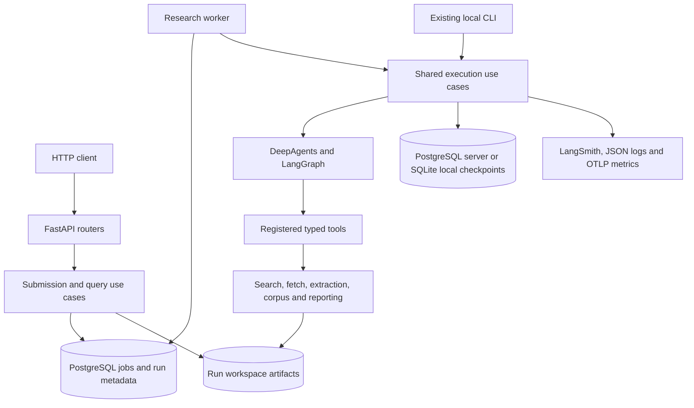

# FastAPI migration plan

Date: 2026-10-02, America/Costa_Rica. Repository inspected at `6cbaa72`.

Status: proposed implementation plan. The modules, endpoints, settings, and commands below are planned additions. This document does not implement the migration.

## Recommended architecture

Add FastAPI as an HTTP entry point to the existing Python application. Keep the agents, registered tools, provider services, Pydantic contracts, and Markdown artifacts. Extract shared application use cases so the CLI and HTTP worker execute the same business logic.

Run research in a separate worker process. Persist accepted jobs in PostgreSQL and use PostgreSQL-backed LangGraph checkpoints for server execution. Keep the existing SQLite checkpoint option for local CLI execution. PostgreSQL is already the server upgrade path in [PD-019](../../../SPECS.md#pd-019--resume-with-a-per-run-sqlite-checkpointer) and [ADR 0007](../../adr/0007-per-run-sqlite-checkpointer.md).

Start with one API process, one research worker processing one job at a time, and a persistent filesystem volume shared by those processes on one host. This is the initial deployment assumption. Multiple hosts require shared artifact storage and coordinated crawler limits before increasing worker concurrency.



The worker is an architectural recommendation for this application's long-running research jobs. FastAPI's documentation also recommends separate task infrastructure for heavy background work. A durable database queue lets accepted work survive API restarts; request-local background tasks do not provide that job lifecycle. [FastAPI background tasks](https://fastapi.tiangolo.com/tutorial/background-tasks/)

## Findings in the current code

| Area | Current implementation | Migration implication |
| --- | --- | --- |
| Entry point | [workflows/cli.py](../../../workflows/cli.py) owns argument parsing, mode selection, printing, and exit codes | Extract use cases; HTTP handlers must not invoke `main()` or parse console output |
| Full research | [workflows/research_run.py](../../../workflows/research_run.py) calls a skeleton agent with a search-bound registry | Full research is a prerequisite gap, not an already complete API handler |
| Tools | [tools/registry.py](../../../tools/registry.py) replaces corpus/citation stubs only when their sessions are supplied; [tools/stubs.py](../../../tools/stubs.py) still registers the report stub | Production execution must bind real tools and verify artifact creation |
| Working milestones | [search](../../../workflows/search_run.py), [corpus](../../../workflows/corpus_run.py), [authoring](../../../workflows/authoring_run.py), and [reporting](../../../workflows/reporting_run.py) workflows exist | Reuse their behavior, validation, and tests when completing the shared execution path |
| Outcome contracts | Milestone summaries use `completed`/`failed`; `RunReport` uses `succeeded`/`degraded`/`failed` | Stage completion must not be presented as successful full research |
| Report path | Authoring writes an `AuthoringSummary` to `output/run.json`; reporting writes a full `RunReport` there | Separate the authoring gate record from the final report before exposing a typed report endpoint |
| Resume | [workflows/resume.py](../../../workflows/resume.py) finds the next phase; the CLI prints that phase | Implement actual continuation before enabling a resume API |
| Checkpoints | [services/checkpoints.py](../../../services/checkpoints.py) supplies savers, but [build_deep_agent](../../../agents/deep_research.py) does not accept a checkpointer | Wire saver ownership and `thread_id` into the execution graph |
| Workspace identity | [services/workspace.py](../../../services/workspace.py) creates `<slug>-<UTC-second>` directories with no overwrite | Separate job identity from run identity and handle allocation collisions explicitly |
| Blocking work | Workflows use synchronous graph invocation; fetch runs a private event-loop thread; corpus uses five collection threads | Keep research out of HTTP request handlers; retain these execution boundaries initially |
| Observability | [services/observability.py](../../../services/observability.py) owns run tracing, accounting, logs, and flushing | Create a fresh observer for every worker attempt; preserve outcome-aware tracing |
| Quality and packaging | [pyproject.toml](../../../pyproject.toml) explicitly lists packages, typing targets, and coverage sources | Include every new package in wheels, source distributions, typing, coverage, and CI |

Treat source code and executable checks as the baseline. A story marked done does not prove that its behavior is wired into the full research entry point.

## Scope and invariants

The first server release is for a single operator. It supports job submission, status polling, research results, bounded log reads, artifact downloads, and verified resume. A frontend, public multi-user accounts, streaming model tokens, cancellation during a model call, CMS publishing, and multi-host execution are later work.

Preserve the business rules in [SPECS.md](../../../SPECS.md): agents orchestrate through registered tools; source files are immutable; citations resolve only against the saved corpus; fetches respect robots.txt and crawler limits; repair passes and retries remain bounded. Keep final `RunReport` fields and the CLI exit-code mapping defined by PD-008 and PD-017.

For server execution, document the PostgreSQL checkpoint decision as an extension of PD-019. Persist requests, configuration snapshots without secrets, phase state, logs, and final reports in the run workspace; PostgreSQL holds operational job metadata and server checkpoints. Local CLI runs continue to use their existing workspace/checkpoint layout. Existing SQLite checkpoints require an explicit importer or continued local execution; changing the backend alone does not migrate their contents.

## Package and ownership changes

```text
api/
  main.py                  # create_app(), lifespan, router registration
  dependencies.py          # settings, repositories, identity, request ID
  middleware.py            # request correlation and HTTP telemetry
  routers/
    health.py
    jobs.py
    runs.py
application/
  context.py               # resources owned by one execution attempt
  ports.py                 # job, artifact and checkpoint interfaces
  migrations.py            # explicit database and checkpoint preparation
  job_service.py           # admission, idempotency and status queries
  run_service.py           # execute/resume shared research use cases
workers/
  research_worker.py       # claim jobs, execute, record outcome, shut down
schemas/
  api.py                   # HTTP request/response and error contracts
  jobs.py                  # durable job records and state transitions
services/
  postgres_jobs.py          # transactional queue and metadata adapter
  artifact_reader.py       # bounded reads and authorized artifact lookup
  checkpoints.py           # local SQLite and server PostgreSQL factories
ops/api/
  compose.yaml             # database, API and worker; persistent volumes
  migrations/              # versioned SQL migrations and checksums
```

`api/` owns transport concerns. `application/` owns admission and execution use cases. `workers/` owns scheduling. Existing `services/`, `tools/`, `agents/`, and `prompts/` retain their current responsibilities. Business modules must not import FastAPI request/response types.

Add `fastapi`, `uvicorn[standard]`, `psycopg[binary,pool]`, and `langgraph-checkpoint-postgres` during implementation, resolve compatible versions with `uv`, and commit the lockfile. Use versioned SQL migrations for the initial queue; an ORM is optional rather than a prerequisite.

Add an `ApiSettings` model alongside `RunSettings` for the secret database DSN and bearer token, server workspace root, queue limits, worker heartbeat settings, and allowed origins. A server-only `API_RUN_PROFILE=fixture` setting selects fake providers for local integration demos; clients cannot enable it in a request. Default production execution uses the existing provider settings.

Use `create_app()` and FastAPI lifespan to initialize settings and short-lived database access, validate schema compatibility, and close process resources. Worker execution owns its own providers, fetch service, graph, saver scope, ledger, and observer. Importing an API module must not start workers, create run directories, or contact providers. [FastAPI lifespan](https://fastapi.tiangolo.com/advanced/events/)

Use ordinary `def` routes/dependencies for initial synchronous database and filesystem access, or explicitly offload that access when using `async def`. A synchronous helper called inside an async handler does not automatically move to a thread pool. Converting every workflow to async is a separate optimization after parity is established. [FastAPI concurrency](https://fastapi.tiangolo.com/async/)

## Proposed HTTP contract

All business endpoints use `/v1`. Reuse `ResearchRequest`, `QueryVariants`, and `RunReport` inside API-specific contracts. For server admission, enforce configured maximum budgets; initial caps are three topic pages and 30 clean URLs, with SerpApi requiring `per_page=10`. Clients cannot supply provider keys, server filesystem paths, arbitrary model endpoints, or telemetry configuration.

| Endpoint | Result | Availability |
| --- | --- | --- |
| `GET /health/live` | Process health, no provider calls | API bootstrap |
| `GET /health/ready` | Database/schema, storage and worker readiness; 503 when submission cannot proceed | Durable worker milestone |
| `POST /v1/runs` | 202 accepted job; `mode: search` initially, `mode: research` after full execution passes | Submission milestone |
| `GET /v1/jobs/{job_id}` | Job status, current phase, run ID when assigned, safe failure reasons and result links | Submission milestone |
| `GET /v1/runs` | Paginated registered runs | Read API milestone |
| `GET /v1/runs/{run_id}` | Persisted phase progress, latest execution status, artifact availability | Read API milestone |
| `GET /v1/runs/{run_id}/report` | Validated final `RunReport`; 409 `report_not_ready` before final reporting | Full research milestone |
| `GET /v1/runs/{run_id}/artifacts` | Allowlisted artifact IDs, media types, sizes and download links | Artifact milestone |
| `GET /v1/runs/{run_id}/artifacts/{artifact_id}` | Authorized artifact download; Markdown served as an attachment | Artifact milestone |
| `GET /v1/runs/{run_id}/logs?cursor=...&limit=...` | Bounded JSON log records and next cursor | Artifact milestone |
| `POST /v1/runs/{run_id}/resume` | 202 new attempt for an eligible interrupted run | Verified recovery milestone |

The accepted job gets an opaque UUID immediately. The canonical run ID is assigned by the worker after provider/configuration preflight and workspace allocation. Return `Location: /v1/jobs/<job_id>`; `run_id` may be null while queued. This avoids inventing a workspace before existing preflight checks have passed.

Example accepted response:

```json
{
  "job_id": "5ce657a4-0e2e-4a27-85cd-dbb48d2f49d6",
  "status": "queued",
  "operation": "research",
  "run_id": null,
  "links": {"status": "/v1/jobs/5ce657a4-0e2e-4a27-85cd-dbb48d2f49d6"}
}
```

Job states are `queued`, `running`, `succeeded`, `degraded`, `failed`, and `interrupted`. A search job's success means search completed. A research job's terminal outcome comes from the final report, including degraded results and reports returned without raising an exception. Polling an existing failed job still returns HTTP 200 with its failed status and reasons.

Map malformed input to 422, unknown resources to 404, invalid transitions/idempotency conflicts to 409, admission limits to 429 with `Retry-After`, and unavailable server configuration/storage to 503. Return a typed error envelope with a stable code, safe message, and request ID. Provider/model failures after admission belong in the durable job result; raw exceptions and secret-bearing configuration must not reach clients.

## Durable submission and execution

Store jobs with request JSON/hash, operation, optional run ID, state, timestamps, current phase, attempt number, idempotency key, worker identity, lease/heartbeat fields, and safe terminal reasons. Keep checkpoint tables separate from queue tables: a graph checkpoint does not mean a job was accepted or completed.

Require an `Idempotency-Key` for submissions and resume requests. Within one transaction, the same key and normalized payload return the original job; a changed payload returns 409. Apply a unique constraint and enforce a bounded queue before returning 202. The PostgreSQL job table is also the queue, avoiding a database/broker dual-write gap in this deployment.

Claim work transactionally with `FOR UPDATE SKIP LOCKED`, update ownership, then commit before performing research. PostgreSQL documents this locking option as useful for queue-like tables. The application still needs leases, recovery policy, and exclusive workspace ownership. [PostgreSQL SELECT locking](https://www.postgresql.org/docs/current/sql-select.html)

Preserve the current run-ID format and no-overwrite guard. Retry only workspace allocation on a timestamp collision, waiting for a new UTC second with a small bounded retry budget. Do not retry the entire research job to obtain a directory. Store the chosen run ID before substantive work; reconcile a crash between directory creation and that update using a small allocation manifest carrying the job ID inside the workspace.

Initially execute one job at a time. Existing fetch limits apply per `FetchService`; increasing job concurrency would multiply aggregate fetches and separate per-host throttles. Add shared crawler scheduling/rate limits before increasing concurrency.

Use an exclusive OS workspace lock on the single-host deployment in addition to database ownership. An expired heartbeat alone cannot authorize a second process to write into the same workspace. Mark an expired attempt interrupted; resume only after the old writer is stopped or the workspace lock is available. Do not claim exactly-once model/search calls across crashes.

## Complete production orchestration and resume

The full execution use case must bind the actual search, corpus, authoring, citation, and report tools to the orchestrator. Retain the documented four sub-agents and their tool assignments. Reuse milestone implementations as components and characterization fixtures, while keeping the orchestrator responsible for phase ordering and todos.

Before enabling `mode: research`:

1. Give `build_deep_agent` an owned checkpointer and configure `thread_id=run_id`. Preserve the restricted serialization rules for typed state. Validate PostgreSQL round-tripping of `RunState` and tool state updates; do not use a general pickle fallback.
2. Bind production sessions per run; forbid stub tools in production execution. Implement the real registered `write_run_report` tool and retain the deterministic reporting service.
3. Record phase completion only after its artifacts pass validation. Persist authoritative state after synthesis, writing, and citation checks, as well as search and corpus work.
4. Move the authoring gate summary to a separate artifact such as `output/authoring.json`. Keep `output/run.json` for the final `RunReport`; teach legacy reads to distinguish the two existing shapes.
5. Carry authoring reasons into final classification: invalid structure is a phase failure, length outside the allowed range is degraded, and unresolved citations fail. Include mismatched References when enforcing the citation gate.
6. Preserve one draft generation and at most two repair passes across resumed attempts. Persist attempt budgets before issuing model work; an ambiguous writer interruption requires reconciliation rather than blind regeneration.
7. Keep one worker-owned observability scope for a complete attempt. Merge actual usage, timings, retries, URL outcomes, and citation findings into the final report before recording the job's terminal state.

Use PostgreSQL savers for server graphs and SQLite savers for local execution. Initialize the server saver schema through the migration/startup preparation command, not on every request. LangGraph documents persistent checkpointers, thread-scoped recovery, and the PostgreSQL saver setup requirement. [LangGraph persistence](https://docs.langchain.com/oss/python/langgraph/persistence), [PostgreSQL saver setup](https://docs.langchain.com/oss/python/langgraph/add-memory#use-in-production)

Resume must actually continue the saved graph/phase and produce the remaining artifacts. Validate job eligibility, checkpoint identity, ordered phase history, existing immutable source files, and remaining retry/repair budgets. Resume creates a new attempt on the same run, excludes completed work, and preserves source hashes. Missing or incompatible checkpoints return a clear conflict; completed runs cannot be resumed accidentally.

Keep direct local CLI execution available. Add an optional server client mode later, using the same HTTP contract. Local execution and server execution use separate configured workspace roots by default; server-owned workspaces are mutated through the worker. Import legacy local runs only through an explicit validated import action that records artifact availability and checkpoint compatibility.

## HTTP access, artifacts, and observability

Bind the development API to `127.0.0.1`. Configure a bearer token for shared server access, TLS termination, explicit allowed origins, and run-access checks before binding it beyond loopback. The first release has one operator identity; per-user authentication/tenant isolation is a separate expansion.

Resolve run IDs through trusted metadata and artifact IDs through a server-side allowlist. Enforce containment under the configured workspace root and reject traversal and symlink escapes. Do not mount all of `runs/` as static files. Provider secrets, raw HTML caches, and checkpoint databases are not downloadable artifacts. Bound log pages and file sizes; serialize only validated public response models.

Persist request/job/run correlation IDs. HTTP middleware measures short API requests; worker telemetry measures research execution and queue wait separately. Each worker attempt creates and closes its own run observer, with `run_id`, topic, job ID, and attempt metadata. Carry validated trace correlation data through the job record and link the worker span to the submission; do not rely on an HTTP request's in-memory tracing context surviving into another process.

Verify successful, degraded, and failed roots against their real reports. The recent `run_failed` smoke issue is a regression case: trace upload/completion alone is insufficient evidence of research success. Keep successful and deliberate-failure fixtures distinct. Add low-cardinality API/queue metrics; preserve existing run-level logs and report accounting.

## Implementation sequence and acceptance gates

| Phase | Deliverable | Required acceptance evidence |
| --- | --- | --- |
| M1: Shared application boundary | Typed use cases, settings profiles, dependency ports, ADRs, CLI delegation | Existing CLI contracts and offline demos pass; domain code has no FastAPI imports |
| M2: HTTP foundation | App factory, lifespan, health, typed read APIs, safe errors, package/CI changes | Import has no side effects; lifespan closes resources; OpenAPI schemas and bounded reads validated |
| M3: Search vertical slice | PostgreSQL migrations, idempotent submission, worker, job polling, search-only execution | Real HTTP 202 before work completes; duplicate submission creates one job; API restart preserves accepted jobs; completed search artifacts validate |
| M4: Full research | Production tool wiring, authoritative phase persistence, final report, PostgreSQL checkpointer | All nine phases produce real artifacts; succeeded/degraded/failed cases match reports; no production stubs; report path contains only a `RunReport` |
| M5: Recovery and access | Actual resume, workspace ownership, safe downloads/logs, shared-access controls | Kill/restart worker and continue remaining phases; source hashes unchanged; conflicting writers denied; traversal, symlinks and unauthorized reads rejected |
| M6: Delivery and cutover | Compose deployment, HTTP/worker telemetry, package verification, runbook | Fresh checkout starts DB/API/worker; installed wheel provides entry points; CLI/server fixture outcomes agree; PM walkthrough records actual commands and outputs |

Deliver each phase as a reviewable change. Enable research submissions only after M4, and advertise recoverable execution only after M5. Use feature/configuration gates rather than returning success for unavailable capabilities.

Update product decisions and add the next available numbered ADRs during implementation for HTTP job semantics, PostgreSQL execution, and artifact ownership. Do not renumber existing epics or mark planned functionality done in `SPECS.md`.

## Verification strategy

Keep the existing network-free pytest gate. Test routes in process with overridden repositories/providers and a fake model; disable `.env` loading and clear the new API/database environment prefixes in test isolation. Exercise lifespan with a context-managed test client. Add meaningful tests for idempotency, real report classification, pipeline wiring, atomic claims, phase recovery, bounded artifact reads, and trace/error isolation.

Run PostgreSQL-specific claim/constraint tests and actual HTTP/worker crash tests as explicit integration commands outside offline pytest. The current suite blocks sockets; do not weaken that guard for server tests. A fixture integration profile must make no real model, search, or website calls while exercising a real database, API process, and worker.

Extend `make check`, typing targets, coverage sources, package lists, and CI for `api`, `application`, and `workers`. Maintain the 80% coverage gate, architecture/import checks, existing epic demos, and build verification. Run `make eval` when validating production generation or preparing a release; API fixture checks do not replace the existing release evaluation gate.

## Proposed setup and PM demo

These are future commands to implement and verify, not successful commands from this planning session.

Dependency setup during implementation:

```sh
uv add fastapi 'uvicorn[standard]' 'psycopg[binary,pool]' langgraph-checkpoint-postgres
make setup
make check
```

Proposed developer workflow, using the same settings and mounted workspace as the worker:

```sh
docker compose -f ops/api/compose.yaml up -d postgres
uv run --locked python -m application.migrations
uv run --locked uvicorn api.main:create_app --factory --host 127.0.0.1 --port 8000
```

In a separate terminal:

```sh
uv run --locked python -m workers.research_worker
```

The application-factory launch syntax and loopback binding are supported by [Uvicorn settings](https://uvicorn.dev/settings/). Select and pin the PostgreSQL image during implementation. Keep database credentials in ignored environment configuration; readiness verifies schema and worker health without paid provider requests.

Proposed deterministic PM acceptance command: `make demo-api`, which starts an isolated fixture profile, submits a topic, polls its job, checks final artifacts, restarts the worker at a controlled phase, and records its evidence. It must use separate temporary storage from real research runs.

For a manual walkthrough after M4:

```sh
curl --fail --silent --show-error http://127.0.0.1:8000/health/ready
curl --include --silent --show-error \
  -H 'Content-Type: application/json' \
  -H 'Idempotency-Key: pm-fastapi-demo-1' \
  -d '{"mode":"research","topic":"Research telemetry quality","pages":1,"per_page":10,"max_urls":2}' \
  http://127.0.0.1:8000/v1/runs
```

Copy the returned job ID and poll `/v1/jobs/<job_id>`. Once the run ID is assigned, open its status, final report, and blog download through the returned links. These commands assume the local fixture profile; shared-access demos must authenticate, and live-provider demos use server-side credentials.

PM evidence must include the actual 202 response and Location header, terminal job outcome, validated report, source/citation checks, an error-free successful LangSmith trace, deliberate degraded/failed examples, an API-restart persistence check, and a worker-resume check with unchanged source hashes. Record exact commands, stdout/stderr, exit statuses, tested source revision, and artifact hashes under `docs/evidence/fastapi/`; write the final execution runbook under `docs/SPECS-LOGS/FASTAPI-MIGRATION-RUNBOOK.md`.

## Rollout and rollback

Deploy the first server beside the existing local CLI, with dedicated server artifact storage and backward-compatible readers. Use additive database migrations and versioned API contracts. Switching clients back to local CLI execution is the initial fallback; preserve server jobs, checkpoints, and artifacts for later recovery rather than moving them implicitly into local storage.

For server upgrades, pause new admissions, drain the worker or record interrupted attempts, deploy compatible code/schema, verify readiness, and resume processing. Stop the API and worker before reverting to an earlier compatible version. Do not remove persistent volumes or use a rollback that cannot read jobs/checkpoints created by the newer version.

## Definition of done

- [ ] CLI and API worker share typed business use cases and preserve the documented agent/tool boundaries.
- [ ] Submission returns a durable job; idempotency and queue limits are verified.
- [ ] Full research uses real production tools and writes a validated final report.
- [ ] Report outcome, job outcome, exit code, and trace error state agree.
- [ ] Process interruption and actual resume are verified without rewriting existing sources or exceeding generation/repair budgets.
- [ ] Artifact access, log bounds, and shared-access checks pass.
- [ ] Packaging, strict typing, offline coverage, real database/HTTP integration, and required evaluation checks pass.
- [ ] A fresh checkout can start the stack and demonstrate the behavior using a recorded runbook and inspectable PM evidence.
